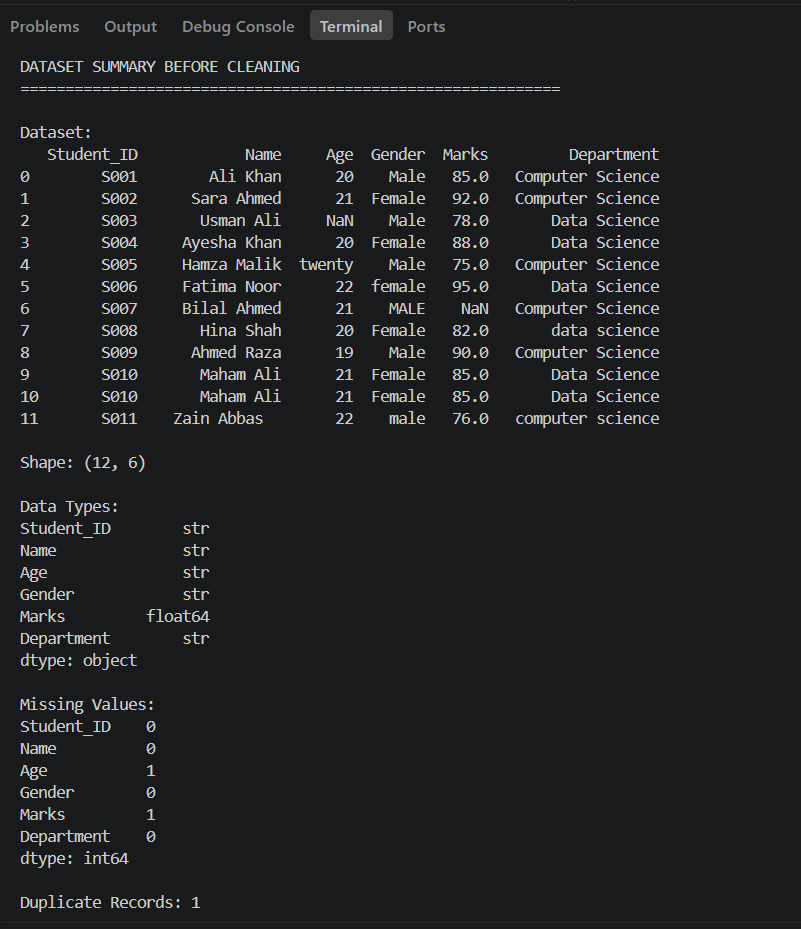
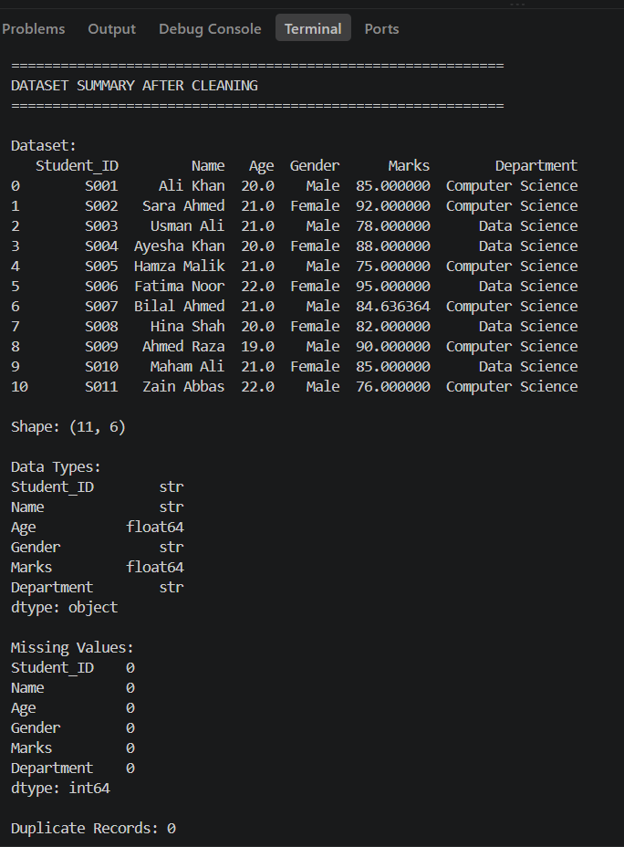

# Day 10 - Data Cleaning with Pandas

## Student Data Cleaning Pipeline

### Project Overview

The Student Data Cleaning Pipeline is a Python and Pandas based project designed to clean and prepare a real-world style student dataset for analysis and Machine Learning.

The dataset intentionally contains common data quality issues such as missing values, duplicate records, incorrect data types, inconsistent text formatting, and extra spaces.

### Objectives

- Identify missing values
- Handle missing values appropriately
- Detect and remove duplicate records
- Correct incorrect data types
- Standardize inconsistent text values
- Validate dataset quality before and after cleaning
- Generate a cleaning report

### Technologies Used

- Python
- Pandas
- CSV
- VS Code

### Dataset Issues

The original dataset contained:

- 2 missing values
- 1 duplicate record
- Invalid age values
- Inconsistent gender formatting
- Inconsistent department formatting
- Extra spaces in text values

### Data Cleaning Operations

The following cleaning operations were performed:

1. Loaded the CSV dataset using Pandas.
2. Inspected the dataset before cleaning.
3. Identified missing values.
4. Converted Age and Marks to numeric data types.
5. Filled missing Age values using the median.
6. Filled missing Marks values using the mean.
7. Removed duplicate records.
8. Removed extra spaces from text values.
9. Standardized Gender values.
10. Standardized Department values.
11. Validated the dataset after cleaning.
12. Generated a cleaning report.

### Results

| Quality Check | Before Cleaning | After Cleaning |
|---|---:|---:|
| Total Records | 12 | 11 |
| Missing Values | 2 | 0 |
| Duplicate Records | 1 | 0 |
| Invalid Age Values | 2 | 0 |

### Project Files

- `student_data.csv` - Original dataset containing intentional data issues
- `cleaned_student_data.csv` - Cleaned and validated dataset
- `data_cleaning.py` - Main Python cleaning pipeline
- `day-10_before-cleaning.png` - Before cleaning screenshot
- `day-10_after-cleaning.png` - After cleaning screenshot

### Screenshots

#### Before Cleaning

#### After Cleaning

### Conclusion

The Student Data Cleaning Pipeline successfully identified and resolved common data quality issues using Pandas. The cleaned dataset contains no missing values or duplicate records, and important data types and text values have been standardized.

This project demonstrates practical data preprocessing techniques that are essential for Data Analysis and Machine Learning workflows.