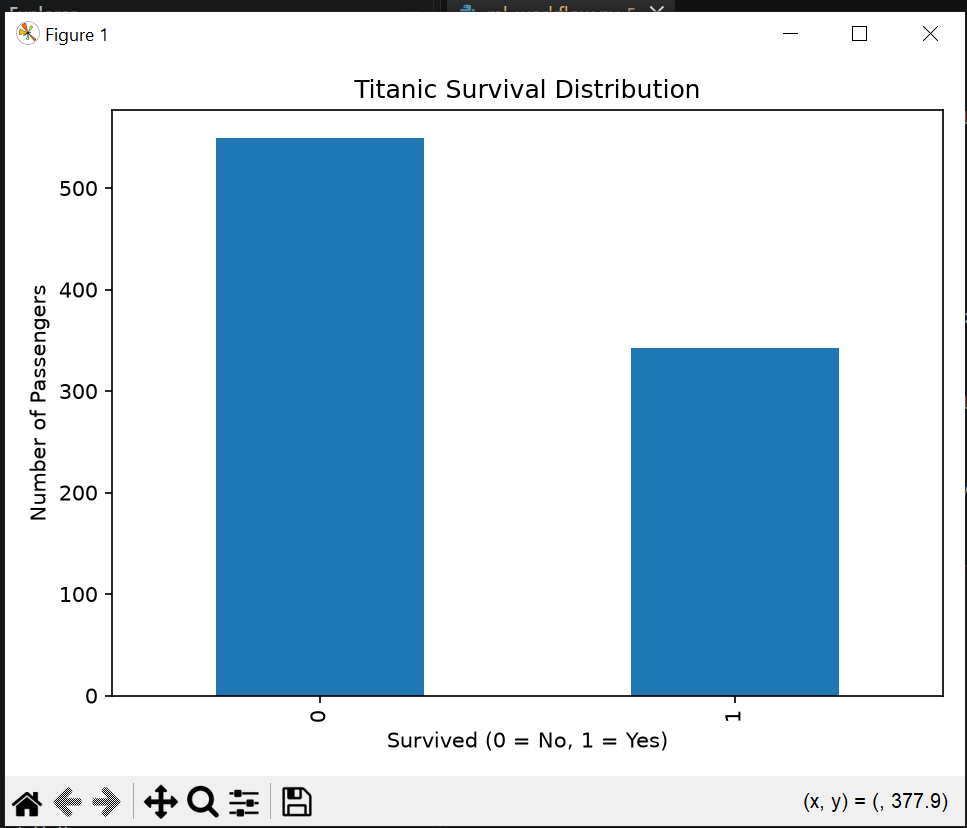
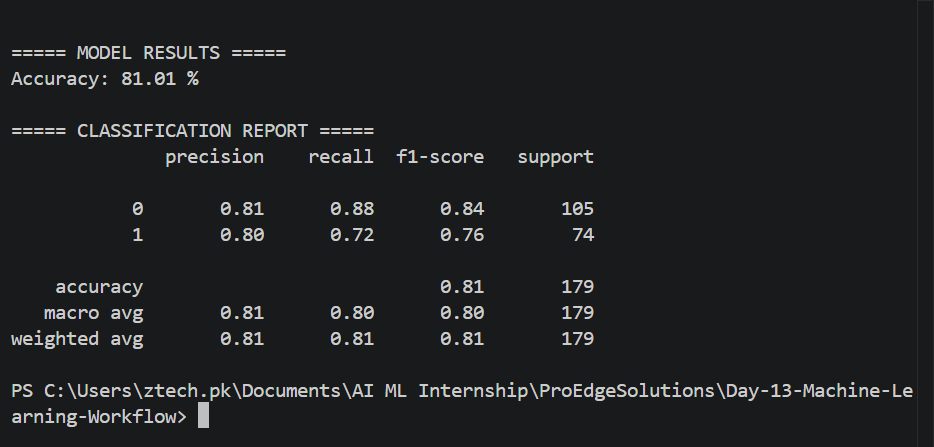

# Day 13 - Machine Learning Workflow & Introduction to ML

## Project Overview

This project demonstrates a complete Machine Learning workflow using the Titanic dataset. The project covers data loading, data exploration, feature selection, train-test splitting, model training, prediction generation, and model evaluation.

## Dataset

The Titanic dataset was obtained from Kaggle.

Dataset file:
- `train.csv`

The target variable is:

- `Survived`
  - `0` = Did not survive
  - `1` = Survived

## Technologies Used

- Python
- Pandas
- NumPy
- Matplotlib
- Scikit-Learn
- Logistic Regression

## Machine Learning Workflow

### 1. Data Loading

The Titanic dataset was loaded using Pandas.

### 2. Data Exploration

The dataset was explored using:

- Dataset shape
- Column names
- Data types
- First few records
- Missing value analysis
- Statistical summary

### 3. Features and Target

Selected features:

- Pclass
- Sex
- Age
- SibSp
- Parch
- Fare

Target variable:

- Survived

### 4. Data Preprocessing

The `Sex` column was converted into numerical values:

- Male = 0
- Female = 1

Missing values in the `Age` column were filled using the median age.

### 5. Train-Test Split

The dataset was divided into:

- 80% Training Data
- 20% Testing Data

A random state of 42 was used for reproducibility.

### 6. Model Training

A Logistic Regression model was used as the baseline Machine Learning classification model.

### 7. Predictions

The trained model generated predictions on the testing dataset.

### 8. Model Evaluation

The model was evaluated using accuracy and a classification report.

## Model Result

The Logistic Regression model achieved approximately:

**81% Accuracy**

This demonstrates that the baseline model was able to correctly classify a large portion of the passengers in the test dataset.

## Visualization

A bar chart was created to show the distribution of passengers who survived and did not survive.

- `0` = Did not survive
- `1` = Survived

## ML Concepts Learned

### Supervised Learning

Supervised Learning uses labeled data to train a model. The Titanic dataset is an example because the `Survived` outcome is provided for the training data.

### Unsupervised Learning

Unsupervised Learning works with data without labeled target values and is commonly used for clustering and pattern discovery.

### Regression

Regression predicts continuous numerical values, such as house prices or temperature.

### Classification

Classification predicts categories or classes. Titanic survival prediction is a classification problem because the model predicts either `0` or `1`.

### Features

Features are the input variables used by the Machine Learning model.

### Labels

Labels are the target values that the model learns to predict.

### Training Data

Training data is used to teach the Machine Learning model patterns in the dataset.

### Testing Data

Testing data is used to evaluate how well the trained model performs on unseen data.

## Project Observations

- The Titanic dataset contains passenger information and survival outcomes.
- Passenger class, sex, age, family information, and fare were used as features.
- Logistic Regression provided a baseline accuracy of approximately 81%.
- The project demonstrated the complete basic Machine Learning workflow from data loading to evaluation.

## Screenshots

### Titanic Survival Distribution

### Model Results

## Conclusion

This project provided practical experience with the complete Machine Learning workflow. It demonstrated how to load and explore a real-world dataset, prepare features, split data into training and testing sets, train a classification model, generate predictions, and evaluate model performance.