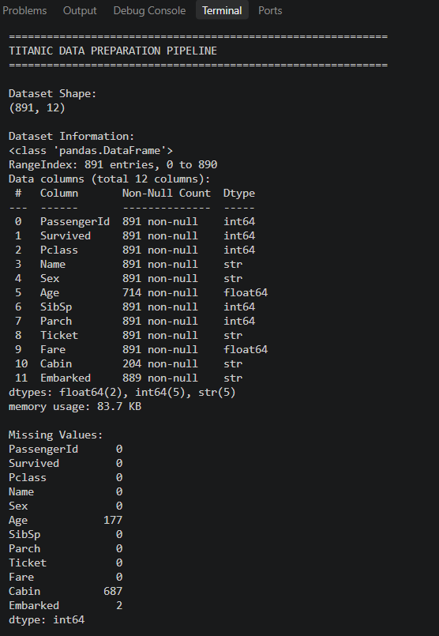
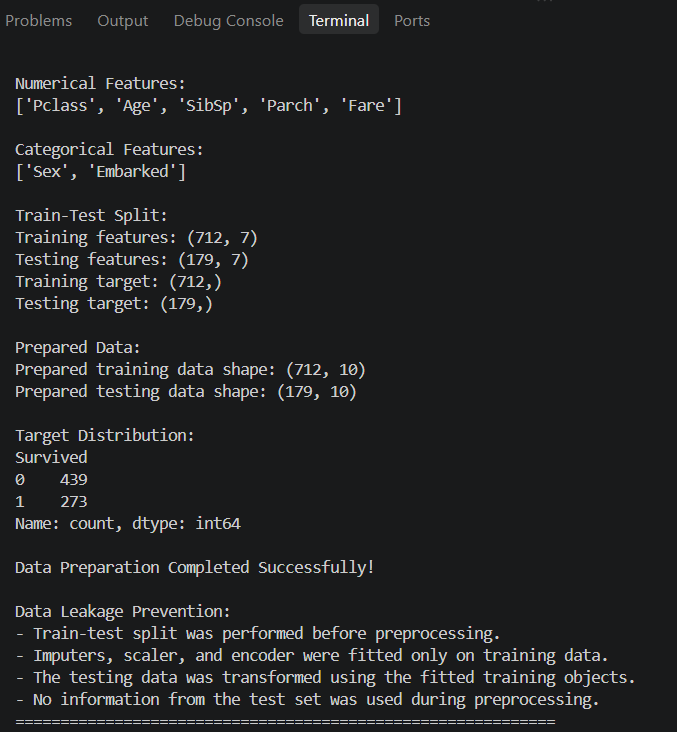

# Day 14 – Data Preparation Pipeline

## Objective

The objective of this task is to prepare raw data for Machine Learning by performing data inspection, handling missing values, encoding categorical features, scaling numerical features, and preventing data leakage.

## Dataset

The Titanic dataset was used for this task.

* Dataset: Titanic – Machine Learning from Disaster
* Rows: 891
* Columns: 12
* Target Variable: `Survived`

## Tools and Libraries

* Python
* Pandas
* NumPy
* Scikit-Learn
* Matplotlib

## Data Inspection

The dataset was loaded using Pandas and inspected for:

* Dataset shape
* Column names
* Data types
* Missing values
* Numerical and categorical features

### Missing Values

The dataset contained missing values in:

* `Age`: 177 missing values
* `Cabin`: 687 missing values
* `Embarked`: 2 missing values

The `Cabin` column was excluded from the model features because of its large number of missing values.

## Feature Preparation

The target variable was separated from the input features.

### Target

* `Survived`

### Numerical Features

* `Pclass`
* `Age`
* `SibSp`
* `Parch`
* `Fare`

### Categorical Features

* `Sex`
* `Embarked`

The columns `PassengerId`, `Name`, `Ticket`, and `Cabin` were excluded from the model features.

## Preprocessing

### Numerical Features

Numerical preprocessing was performed using a Scikit-Learn Pipeline:

1. Missing values were replaced using the median.
2. Numerical features were standardized using `StandardScaler`.

### Categorical Features

Categorical preprocessing was performed using:

1. Missing values replaced with the most frequent value.
2. Categorical features encoded using `OneHotEncoder`.

## Train-Test Split

The dataset was divided before preprocessing:

* Training data: 80%
* Testing data: 20%
* Training samples: 712
* Testing samples: 179
* Random state: 42
* Stratification was applied using the target variable.

## Data Leakage Prevention

Data leakage was prevented by following these steps:

1. The train-test split was performed before preprocessing.
2. Preprocessing objects were fitted only on the training data.
3. The numerical imputer and scaler learned parameters only from training data.
4. The categorical imputer and encoder were fitted only on training data.
5. The testing data was transformed using the already-fitted preprocessing pipeline.
6. No information from the testing dataset was used during preprocessing.

This ensures that the testing data remains unseen during the preprocessing stage.

## Final Results

After preprocessing:

* Prepared training data shape: **712 × 10**
* Prepared testing data shape: **179 × 10**

The data was successfully transformed into a Machine Learning-ready format.

## Observations

* The Titanic dataset contained missing values, particularly in the `Age` and `Cabin` columns.
* Numerical missing values were handled using median imputation.
* Categorical missing values were handled using the most frequent value.
* Categorical features were converted into numerical representations using One-Hot Encoding.
* Numerical features were standardized using `StandardScaler`.
* The preprocessing pipeline successfully prevented data leakage.

## Screenshots

### Data Inspection

### Preprocessing Output

## Conclusion

The Titanic dataset was successfully prepared for Machine Learning model training using a professional Scikit-Learn preprocessing workflow. The pipeline handles missing values, encodes categorical features, scales numerical features, and prevents data leakage by fitting preprocessing steps only on the training data.