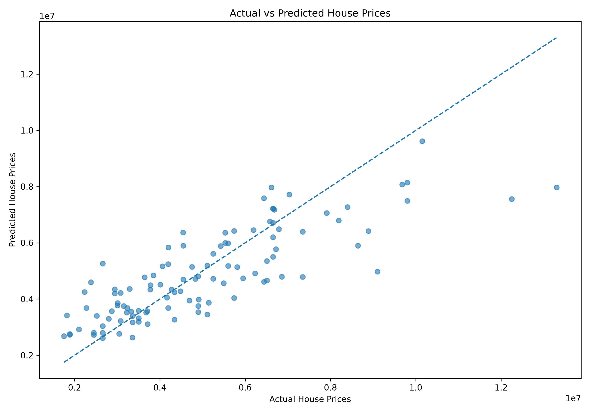
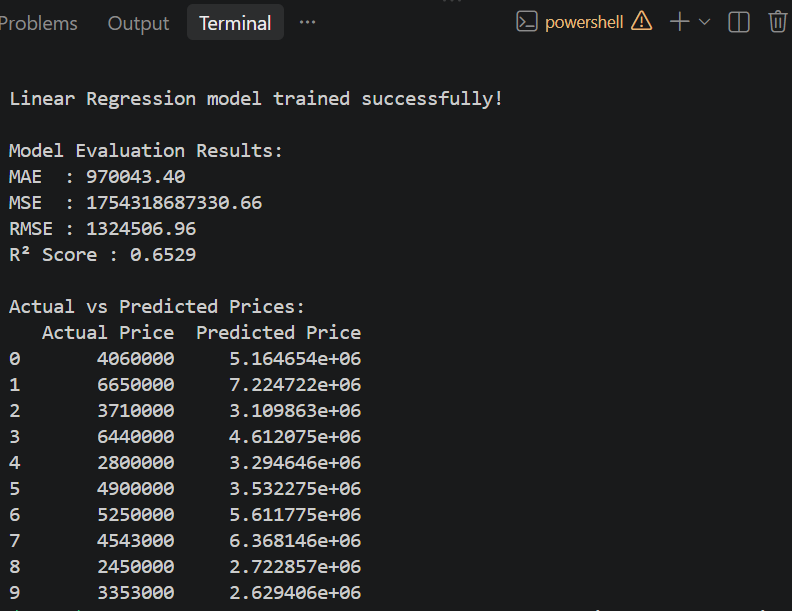

# Day 15 - House Price Prediction using Linear Regression

## Objective

Build a House Price Prediction System using Linear Regression to predict continuous house prices and evaluate model performance using standard regression metrics.

## Dataset

The project uses a Kaggle House Price Dataset containing 545 housing records and 13 original columns.

## Technologies Used

- Python
- Pandas
- NumPy
- Matplotlib
- Scikit-Learn

## Dataset Exploration

- Total Records: 545
- Original Columns: 13
- Missing Values: 0
- Training Records: 436
- Testing Records: 109

## Features

The dataset contains property-related features such as:

- Area
- Bedrooms
- Bathrooms
- Stories
- Parking
- Main Road
- Guest Room
- Basement
- Hot Water Heating
- Air Conditioning
- Preferred Area
- Furnishing Status

The target variable is `price`.

## Data Preparation

1. Loaded the dataset using Pandas.
2. Explored the dataset structure and statistical summary.
3. Checked for missing values.
4. Converted categorical features into numerical values using one-hot encoding.
5. Separated features (`X`) and target (`y`).

## Model Development

A Linear Regression model from Scikit-Learn was used.

The dataset was divided into:

- 80% Training Data
- 20% Testing Data

The model was trained using the training dataset and predictions were generated for the test dataset.

## Model Evaluation

The model was evaluated using MAE, MSE, RMSE, and R² Score.

| Metric | Result |
|---|---:|
| MAE | 970,043.40 |
| MSE | 1,754,318,687,330.66 |
| RMSE | 1,324,506.96 |
| R² Score | 0.6529 |

## Results Analysis

The Linear Regression model achieved an R² Score of **0.6529**, meaning that the model explains approximately **65.29% of the variation in house prices** in the test dataset.

The MAE shows an average prediction error of approximately **970,043 price units**. The RMSE is approximately **1,324,507**, indicating that some larger prediction errors are present.

Overall, the model provides a useful baseline for house price prediction.

## Visualization

The project includes an Actual vs Predicted House Prices visualization.

### Actual vs Predicted House Prices

## Screenshots

### Model Evaluation Output

### Actual vs Predicted Graph

## Project Files

- `Housing.csv` - House price dataset
- `house_price_prediction.py` - Main Python program
- `actual_vs_predicted.png` - Actual vs predicted visualization
- `model_evaluation_output.png` - Model evaluation output screenshot
- `README.md` - Project documentation

## Conclusion

The House Price Prediction system successfully demonstrates a complete Linear Regression workflow, including data loading, preprocessing, model training, prediction, evaluation, and visualization.