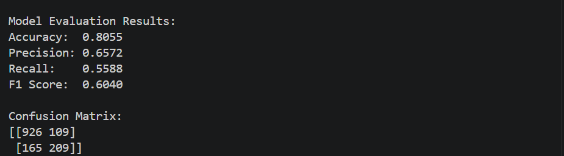

# Day 16 – Customer Classification using Logistic Regression

## Project Overview

This project focuses on building a **Customer Classification System using Logistic Regression**. The main objective is to understand how Logistic Regression can be used for binary classification and how to evaluate a classification model using standard performance metrics.

The project includes data loading, data exploration, preprocessing, model training, prediction generation, and model evaluation.

## Objective

The objectives of this project are:

* Load and explore a customer classification dataset.
* Prepare the dataset for machine learning.
* Handle missing values where necessary.
* Separate features and target variables.
* Split the dataset into training and testing sets.
* Train a Logistic Regression classification model.
* Generate predictions on test data.
* Compare actual and predicted results.
* Evaluate the model using Accuracy, Precision, Recall, F1 Score, and Confusion Matrix.

## Dataset

A customer classification dataset from Kaggle was used for this project. The dataset contains customer-related features and a binary target variable suitable for classification.

## Technologies Used

* Python
* Pandas
* Scikit-Learn
* Logistic Regression
* Matplotlib

## Machine Learning Workflow

The following workflow was implemented:

1. Loaded the customer dataset using Pandas.
2. Explored the dataset structure and features.
3. Checked and handled missing values where necessary.
4. Prepared the feature and target variables.
5. Split the dataset into training and testing sets.
6. Trained a Logistic Regression model.
7. Generated predictions using the test data.
8. Compared actual and predicted results.
9. Evaluated the model using classification metrics.
10. Analyzed the model performance.

## Model

### Logistic Regression

Logistic Regression is a supervised machine learning algorithm commonly used for binary classification problems. It predicts the probability of an observation belonging to a particular class and then assigns a class based on a classification threshold.

In this project, Logistic Regression was used to classify customers into the two target classes.

## Model Evaluation

The trained model was evaluated using the following metrics:

### Accuracy

Accuracy measures the overall percentage of correctly classified observations.

**Accuracy: 80.55%**

### Precision

Precision measures how many of the customers predicted as positive were actually positive.

**Precision: 65.72%**

### Recall

Recall measures how many of the actual positive customers were correctly identified by the model.

**Recall: 55.88%**

### F1 Score

F1 Score provides a balance between Precision and Recall.

**F1 Score: 60.40%**

## Evaluation Results

| Metric    |  Score |
| --------- | -----: |
| Accuracy  | 80.55% |
| Precision | 65.72% |
| Recall    | 55.88% |
| F1 Score  | 60.40% |

## Confusion Matrix

The confusion matrix obtained from the model is:

```text
[[926 109]
 [165 209]]
```

The values represent:

* **True Negatives (TN): 926**
* **False Positives (FP): 109**
* **False Negatives (FN): 165**
* **True Positives (TP): 209**

## Actual vs Predicted Results

The model predictions were compared with the actual target values from the test dataset to verify the classification performance.

## Results Analysis

The Logistic Regression model achieved an overall accuracy of **80.55%**, meaning that the model correctly classified most of the test observations.

The **Precision of 65.72%** indicates that a reasonable proportion of the customers predicted as positive were actually positive.

The **Recall of 55.88%** shows that the model identified more than half of the actual positive customers. However, some positive customers were still classified as negative.

The **F1 Score of 60.40%** provides a balanced measure of Precision and Recall.

Overall, the model provides a good baseline for the customer classification problem. Its performance could potentially be improved through additional feature engineering, preprocessing, hyperparameter tuning, or trying other classification algorithms.

## Key Findings

* The Logistic Regression model achieved **80.55% accuracy**.
* Precision was **65.72%**.
* Recall was **55.88%**.
* F1 Score was **60.40%**.
* The confusion matrix shows that the model correctly classified **926 negative** and **209 positive** observations.
* The model successfully completed the required binary classification workflow.

## Screenshots

### Model Evaluation Results



### Confusion Matrix


## Conclusion

This project provided practical experience with **Logistic Regression for binary classification**. The complete machine learning workflow was implemented, including data preparation, train-test splitting, model training, prediction generation, and performance evaluation.

The model was successfully evaluated using **Accuracy, Precision, Recall, F1 Score, and Confusion Matrix**, providing a clear understanding of its classification performance.

## Project Status

**Completed Successfully ✅**
