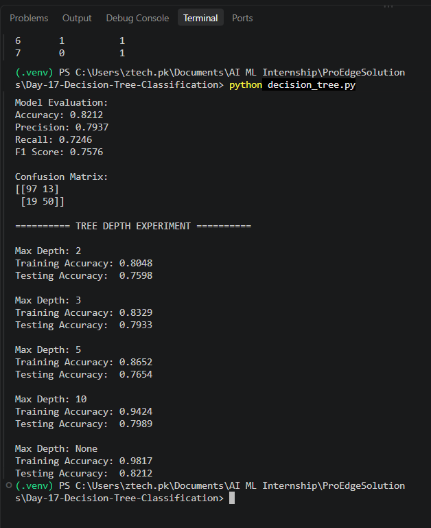

# Day 17 - Decision Tree Classification

## Objective

The objective of this task was to understand how Decision Tree Classification works and how different tree depths affect model performance, overfitting, and underfitting.

## Dataset

**Dataset:** Titanic Dataset
**Source:** Kaggle
**Problem Type:** Classification
**Target Variable:** `Survived`

The model predicts whether a passenger survived the Titanic disaster based on selected passenger features.

## Technologies Used

* Python
* Pandas
* Scikit-Learn
* Decision Tree Classifier

## Data Preparation

The dataset was loaded using Pandas and explored using:

* Column names
* Dataset information
* Missing value analysis

Missing values were handled as follows:

* `Age`: Missing values filled with the median.
* `Embarked`: Missing values filled with the mode.
* `Cabin`: Dropped because it contained a large number of missing values.

Categorical features such as `Sex` and `Embarked` were converted into numerical values using one-hot encoding.

The target variable was `Survived`.

The dataset was split into:

* Training data: 712 rows
* Testing data: 179 rows

## Decision Tree Model

A Decision Tree Classifier was trained using Scikit-Learn.

The initial model achieved:

| Metric    |  Score |
| --------- | -----: |
| Accuracy  | 82.12% |
| Precision | 79.37% |
| Recall    | 72.46% |
| F1 Score  | 75.76% |

## Confusion Matrix

```text
[[97 13]
 [19 50]]
```

The confusion matrix shows the correctly and incorrectly classified observations for the two classes.

## Tree Depth Experiment

Different maximum tree depths were tested to analyze their effect on training and testing performance.

| Max Depth | Training Accuracy | Testing Accuracy |
| --------- | ----------------: | ---------------: |
| 2         |            80.48% |           75.98% |
| 3         |            83.29% |           79.33% |
| 5         |            86.52% |           76.54% |
| 10        |            94.24% |           79.89% |
| None      |            98.17% |           82.12% |

## Overfitting and Underfitting Analysis

At a maximum depth of 2, both training and testing accuracy were relatively low, indicating a tendency toward underfitting.

As tree depth increased, training accuracy increased. However, testing accuracy did not increase consistently. This indicates that deeper trees can learn the training data more closely without producing the same improvement on unseen data.

The unrestricted tree (`max_depth=None`) achieved the highest testing accuracy of 82.12%, but its training accuracy was 98.17%. The large gap between training and testing performance indicates a tendency toward overfitting.

Therefore, tree depth is an important parameter for controlling model complexity and balancing training performance with generalization.

## Project Output

The model successfully:

* Loaded and prepared the dataset
* Handled missing values
* Prepared features and target
* Split the data into training and testing sets
* Trained a Decision Tree Classifier
* Generated predictions
* Calculated classification metrics
* Generated a confusion matrix
* Compared different tree depths
* Analyzed overfitting and underfitting

## Screenshot



## Conclusion

The Decision Tree Classification workflow was successfully implemented using the Titanic dataset. The experiment demonstrated that increasing tree depth generally increases training accuracy, but it can also increase the risk of overfitting. Comparing training and testing performance is therefore important when selecting an appropriate tree configuration.
