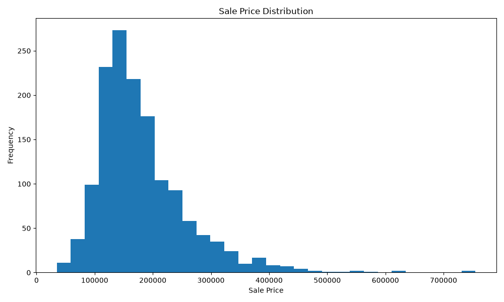
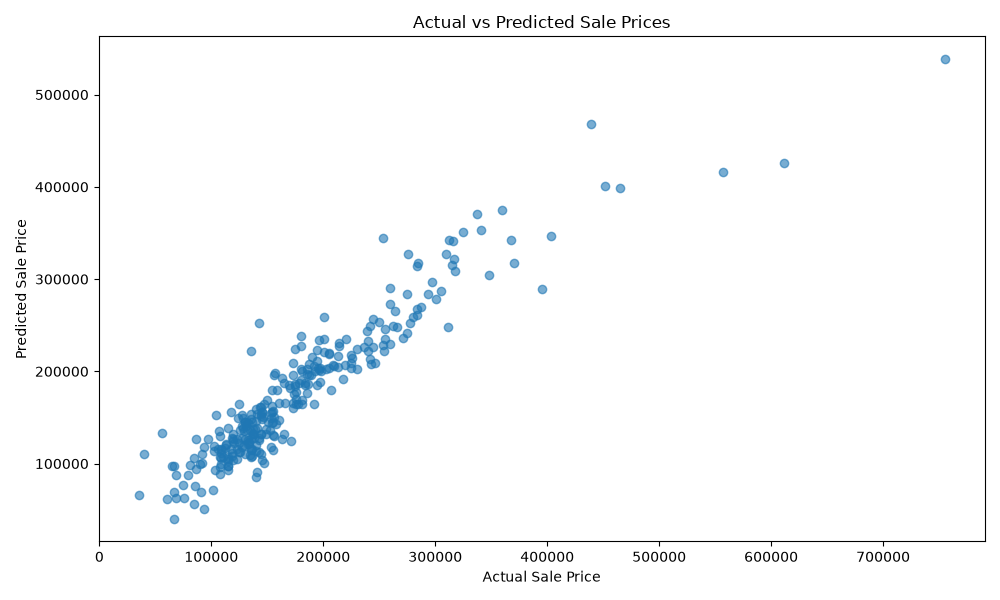

# Day 18 - Complete Regression Pipeline

## Project Overview

This project demonstrates a complete Machine Learning regression workflow using the Kaggle House Prices dataset.

The objective is to predict house sale prices using Linear Regression while applying data preparation, exploratory data analysis, feature engineering, preprocessing, model training, prediction, and evaluation.

## Dataset

* Dataset: House Prices - Advanced Regression Techniques
* Target Variable: `SalePrice`
* Total Records: 1460
* Total Features: 80

## Technologies Used

* Python
* Pandas
* NumPy
* Matplotlib
* Scikit-Learn

## Machine Learning Workflow

### 1. Data Preparation

* Loaded the dataset using Pandas.
* Explored dataset structure and features.
* Identified numerical and categorical features.
* Handled missing values using imputation.
* Prepared the dataset for Machine Learning.

### 2. Exploratory Data Analysis

A Sale Price Distribution visualization was created to understand the distribution of the target variable.

### 3. Feature Engineering & Preprocessing

* Separated features and target variable.
* Identified numerical and categorical features.
* Used median imputation for numerical features.
* Used most-frequent imputation for categorical features.
* Applied One-Hot Encoding to categorical variables.
* Used `handle_unknown="ignore"` to safely process unseen categories.

### 4. Model Development

The dataset was divided into:

* Training Data: 80%
* Testing Data: 20%
* Random State: 42

A Linear Regression model was trained on the processed training data.

### 5. Prediction

The trained model generated predictions for the test dataset and compared actual and predicted sale prices.

### Actual vs Predicted

## Model Evaluation

| Metric   |         Result |
| -------- | -------------: |
| MAE      |      20,485.66 |
| MSE      | 981,430,763.46 |
| RMSE     |      31,327.80 |
| R² Score |         0.8720 |

## Results & Findings

The Linear Regression model achieved an R² Score of approximately **87.20%**, indicating that the model explains a substantial portion of the variation in house sale prices.

The MAE of approximately **20,485.66** represents the average absolute difference between the actual and predicted house prices.

The Actual vs Predicted visualization provides a visual comparison of the model's predictions against the actual sale prices.

## Conclusion

This project demonstrates an end-to-end regression Machine Learning workflow, including data cleaning, EDA, feature engineering, preprocessing, model training, prediction generation, and model evaluation.

The project successfully applies Linear Regression to predict house sale prices and evaluates its performance using MAE, MSE, RMSE, and R² Score.
