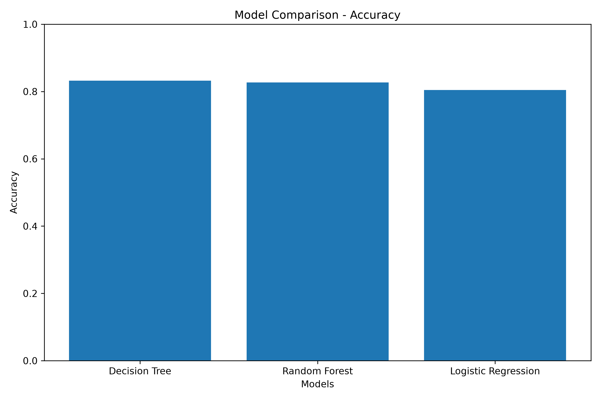
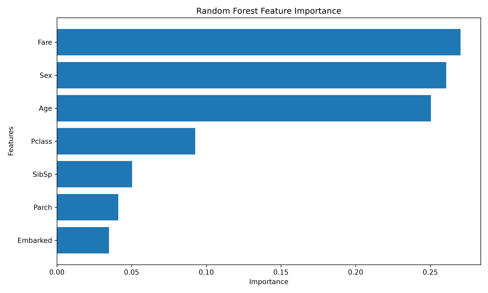

# Day 19 – Model Comparison using Random Forest

## Objective

The objective of this project is to compare different Machine Learning models and understand how Random Forest performs compared with other algorithms. The project also analyzes the most important features using Random Forest feature importance.

## Dataset

Dataset: Titanic Dataset from Kaggle

- Rows: 891
- Columns: 12
- Target Variable: `Survived`

## Technologies Used

- Python
- Pandas
- NumPy
- Matplotlib
- Scikit-Learn

## Data Preparation

The following steps were performed:

1. Loaded and explored the Titanic dataset.
2. Checked missing values.
3. Removed unnecessary columns:
   - PassengerId
   - Name
   - Ticket
   - Cabin
4. Filled missing Age values using the median.
5. Filled missing Embarked values using the mode.
6. Converted categorical variables into numerical values.
7. Separated features and target variable.
8. Split the dataset into training and testing sets.

### Data Split

- Training Data: 712 rows
- Testing Data: 179 rows

## Machine Learning Models

Three classification models were trained on the same dataset:

1. Logistic Regression
2. Decision Tree
3. Random Forest

## Model Comparison

| Rank | Model | Accuracy | Precision | Recall | F1 Score |
|---|---|---:|---:|---:|---:|
| 1 | Decision Tree | 83.24% | 80.00% | 75.36% | 77.61% |
| 2 | Random Forest | 82.68% | 80.65% | 72.46% | 76.34% |
| 3 | Logistic Regression | 80.45% | 79.31% | 66.67% | 72.44% |

## Best Performing Model

The **Decision Tree** achieved the highest accuracy of **83.24%**.

Random Forest achieved **82.68%** accuracy and performed very close to the Decision Tree.

Therefore, based on accuracy, the Decision Tree was the best-performing model for this dataset.

## Model Strengths and Weaknesses

### Logistic Regression

**Strengths:**
- Simple and easy to interpret.
- Fast to train.
- Works well for basic classification problems.

**Weaknesses:**
- May not capture complex relationships between features.
- Lower performance compared with the tree-based models in this project.

### Decision Tree

**Strengths:**
- Easy to understand and interpret.
- Can capture non-linear relationships.
- Achieved the highest accuracy in this comparison.

**Weaknesses:**
- Can overfit the training data.
- Performance can change depending on tree settings.

### Random Forest

**Strengths:**
- Combines multiple decision trees.
- Can capture complex relationships.
- Provides feature importance.
- Usually reduces overfitting compared with a single decision tree.

**Weaknesses:**
- More computationally expensive than a single decision tree.
- Less easy to interpret than one decision tree.

## Random Forest Feature Importance

The Random Forest model identified the following important features:

| Feature | Importance |
|---|---:|
| Fare | 27.02% |
| Age | 25.04% |
| Pclass | 9.25% |
| SibSp | 5.03% |
| Parch | 4.11% |
| Embarked | 3.48% |

The most influential features were **Fare** and **Age**.

## Visualizations

### Model Comparison

### Random Forest Feature Importance

## Conclusion

This project demonstrated how multiple Machine Learning algorithms can be trained and compared on the same dataset.

The Decision Tree achieved the highest accuracy of **83.24%**, while Random Forest achieved **82.68%**.

Random Forest feature importance showed that **Fare and Age** were the most influential features in the model.

Overall, the project provided practical experience with model comparison, ensemble learning, evaluation metrics, and feature importance analysis.