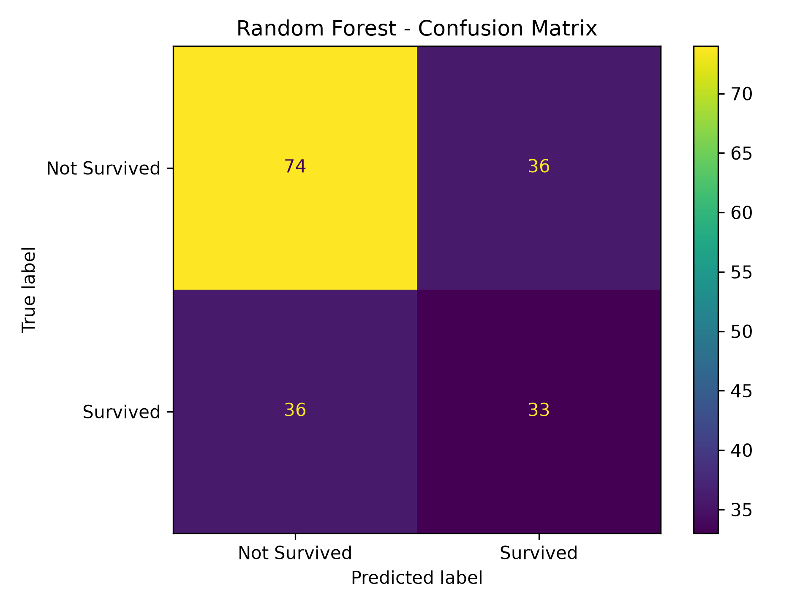
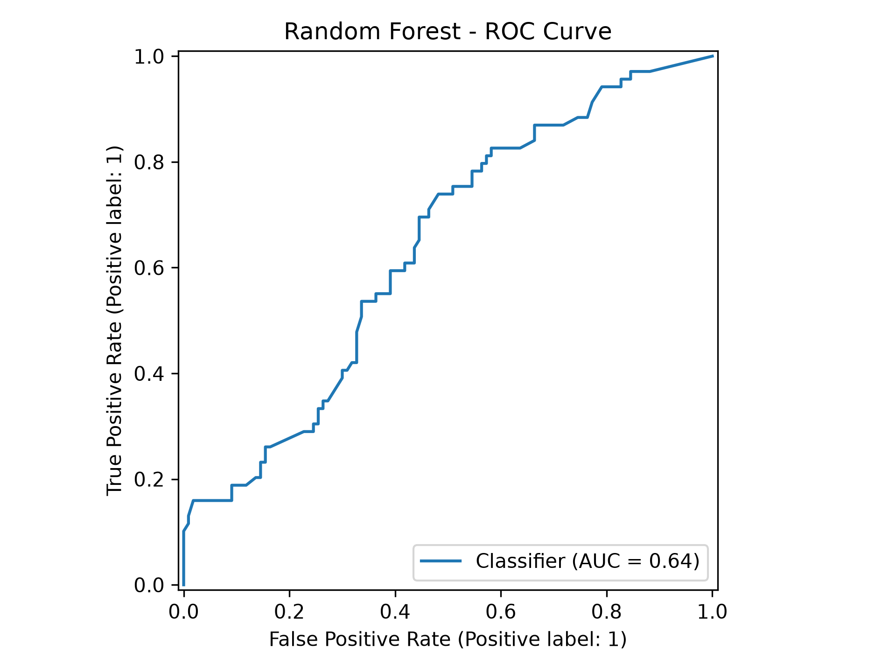
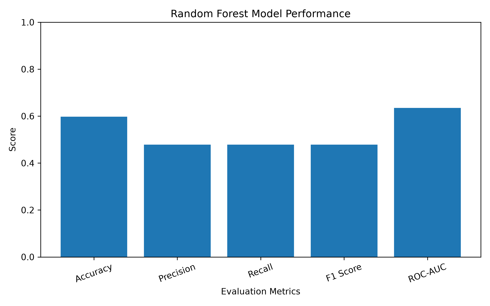

# Day 21 – Model Evaluation & Performance Analysis

## 📌 Project Overview

This project focuses on evaluating the performance of a Machine Learning classification model using different evaluation metrics.

The Titanic dataset and Random Forest Classifier were used to evaluate the model performance. Multiple metrics and visualizations were generated to understand how well the model performs.

---

## 🎯 Objective

The main objectives of this project are:

* Evaluate a classification model using multiple performance metrics.
* Calculate Accuracy, Precision, Recall, F1 Score, and ROC-AUC.
* Generate and analyze a Confusion Matrix.
* Plot the ROC Curve.
* Compare different evaluation metrics visually.
* Save evaluation results for further analysis.

---

## 📂 Dataset

**Dataset:** Titanic Dataset

**Dataset Shape:** `(891, 12)`

The dataset contains information about Titanic passengers, including:

* PassengerId
* Survived
* Pclass
* Name
* Sex
* Age
* SibSp
* Parch
* Ticket
* Fare
* Cabin
* Embarked

---

## 🧹 Data Cleaning

The following preprocessing steps were performed:

* Removed `PassengerId`.
* Removed `Cabin` because of a large number of missing values.
* Filled missing `Age` values with the median.
* Filled missing `Embarked` values with the mode.
* Converted categorical features into numerical features using One-Hot Encoding.
* Selected numerical features for model training.

---

## 🤖 Machine Learning Model

### Random Forest Classifier

The Random Forest algorithm was used for classification.

**Parameters:**

* Number of Estimators: `100`
* Random State: `42`
* Test Size: `20%`
* Stratified Train-Test Split

### Data Split

* Training Data Shape: `(712, 5)`
* Testing Data Shape: `(179, 5)`

---

## 📊 Model Evaluation Results

| Metric    |  Score |
| --------- | -----: |
| Accuracy  | 0.5978 |
| Precision | 0.4783 |
| Recall    | 0.4783 |
| F1 Score  | 0.4783 |
| ROC-AUC   | 0.6352 |

### Confusion Matrix

```text
[[74 36]
 [36 33]]
```

The confusion matrix shows the number of correct and incorrect predictions for both classes.

---

## 📈 Visualizations

### 1. Confusion Matrix



The confusion matrix provides a visual representation of the model's classification results.

---

### 2. ROC Curve



The ROC curve shows the model's ability to distinguish between the two classes at different classification thresholds.

---

### 3. Evaluation Metrics



This chart compares the performance scores of Accuracy, Precision, Recall, F1 Score, and ROC-AUC.

---

## 💾 Output Files

The project generates the following files:

* `evaluation_results.csv` – Contains all evaluation metric scores.
* `confusion_matrix.png` – Confusion Matrix visualization.
* `roc_curve.png` – ROC Curve visualization.
* `evaluation_metrics.png` – Metric comparison chart.

---

## 🛠️ Technologies Used

* Python
* Pandas
* NumPy
* Matplotlib
* Scikit-learn
* Random Forest Classifier
* Git & GitHub

---

## 📁 Project Structure

```text
Day-21-Model-Evaluation-Performance-Analysis/
│
├── model_evaluation.py
├── train.csv
├── evaluation_results.csv
├── confusion_matrix.png
├── roc_curve.png
├── evaluation_metrics.png
└── README.md
```

---

## ✅ Conclusion

The Random Forest model was successfully evaluated using multiple classification metrics.

The model achieved an Accuracy of **59.78%** and a ROC-AUC score of **63.52%**. The evaluation results and visualizations provide a clear understanding of the model's current performance.

This project demonstrates the importance of using multiple evaluation metrics instead of relying only on accuracy.

---

## 🚀 Project Status

**Day 21 – Model Evaluation & Performance Analysis COMPLETED! ✅**
