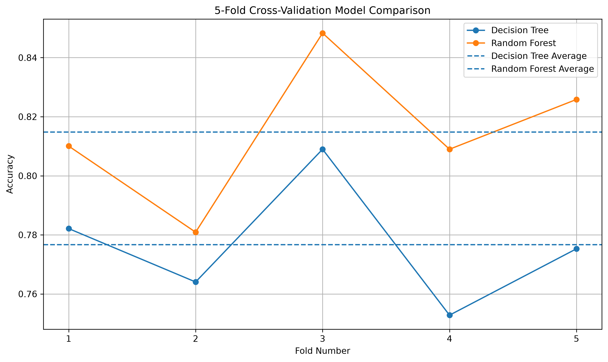

# Day 22 – Cross-Validation & Model Comparison

## 📌 Project Overview

This project focuses on evaluating Machine Learning models using Cross-Validation.

The Titanic dataset was used to compare two classification models:

1. Decision Tree Classifier
2. Random Forest Classifier

A 5-Fold Cross-Validation technique was applied to evaluate the models more reliably and analyze their performance and stability across different folds.

---

## 🎯 Objective

The main objectives of this project are:

- Understand the concept of Cross-Validation.
- Apply K-Fold Cross-Validation.
- Use at least 5 validation folds.
- Evaluate multiple Machine Learning models.
- Record individual fold scores.
- Calculate average validation accuracy.
- Analyze score consistency across folds.
- Identify the most stable model.
- Compare Cross-Validation results with previous train-test split results.

---

## 📊 Dataset

The Titanic dataset was used for this project.

### Dataset Information

- Total Rows: 891
- Total Columns: 12
- Target Variable: `Survived`

### Selected Features

The following features were used:

- Pclass
- Sex
- Age
- SibSp
- Parch
- Fare
- Embarked

Missing values in `Age`, `Fare`, and `Embarked` were handled before model evaluation.

Categorical features were converted into numerical values using one-hot encoding.

---

## 🤖 Machine Learning Models

Two classification models were evaluated:

### 1. Decision Tree Classifier

A Decision Tree was used as the first classification model.

### 2. Random Forest Classifier

A Random Forest with 100 decision trees was used as the second classification model.

---

## 🔄 Cross-Validation Method

5-Fold K-Fold Cross-Validation was used.

The dataset was divided into five different folds. Each fold was used once as the validation set while the remaining folds were used for training.

This process was repeated five times so that every part of the dataset was used for validation.

---

## 📈 Decision Tree Cross-Validation Results

The Decision Tree produced the following accuracy scores:

| Fold | Accuracy |
|------|----------|
| Fold 1 | 0.7821 |
| Fold 2 | 0.7640 |
| Fold 3 | 0.8090 |
| Fold 4 | 0.7528 |
| Fold 5 | 0.7753 |

### Average Accuracy

**0.7766 (77.66%)**

### Standard Deviation

**0.0190**

---

## 🌲 Random Forest Cross-Validation Results

The Random Forest produced the following accuracy scores:

| Fold | Accuracy |
|------|----------|
| Fold 1 | 0.8101 |
| Fold 2 | 0.7809 |
| Fold 3 | 0.8483 |
| Fold 4 | 0.8090 |
| Fold 5 | 0.8258 |

### Average Accuracy

**0.8148 (81.48%)**

### Standard Deviation

**0.0221**

---

## 📊 Model Comparison

| Model | Average Accuracy | Standard Deviation |
|-------|------------------|--------------------|
| Decision Tree | 77.66% | 0.0190 |
| Random Forest | 81.48% | 0.0221 |

The Random Forest achieved the higher average validation accuracy of **81.48%**, compared with **77.66%** for the Decision Tree.

However, the Decision Tree had a slightly lower standard deviation (**0.0190**) than Random Forest (**0.0221**).

This means the Decision Tree showed slightly more consistent performance across the five folds.

---

## 📸 Cross-Validation Performance Graph

The graph below shows the accuracy achieved by both models across the five validation folds.



---

## 🔍 Stability Analysis

The standard deviation was used to analyze model stability.

- Decision Tree Standard Deviation: **0.0190**
- Random Forest Standard Deviation: **0.0221**

A lower standard deviation indicates that the model's performance varies less between different folds.

Therefore, based on the Cross-Validation results, the **Decision Tree was slightly more stable**.

Although Random Forest had higher average accuracy, its scores showed slightly more variation across the folds.

---

## 📋 Performance Across Folds

### Decision Tree

The Decision Tree accuracy ranged from **75.28% to 80.90%** across the five folds.

### Random Forest

The Random Forest accuracy ranged from **78.09% to 84.83%** across the five folds.

Some variation between folds was observed because each fold contains a different subset of the Titanic dataset.

---

## 🔁 Comparison with Previous Train-Test Split

In the previous Decision Tree project, the model achieved approximately **82.12% testing accuracy** using a single train-test split.

In this project, the Decision Tree achieved an average Cross-Validation accuracy of **77.66%**.

The difference occurs because a single train-test split depends heavily on how the dataset is divided.

Cross-Validation evaluates the model on multiple validation sets, providing a more dependable estimate of its generalization performance.

---

## 💡 Why Cross-Validation Is More Reliable

A single train-test split evaluates the model using only one particular division of the dataset.

Cross-Validation provides a more reliable evaluation because:

- Every data sample can be used for validation.
- The model is tested on multiple validation sets.
- Performance variations between different folds can be observed.
- It reduces dependence on one random train-test split.
- It provides an average performance score.
- It helps identify model stability.

---

## 📝 Observations

1. Random Forest achieved the highest average accuracy.
2. Random Forest obtained an average accuracy of **81.48%**.
3. Decision Tree obtained an average accuracy of **77.66%**.
4. Decision Tree had a slightly lower standard deviation.
5. Therefore, Decision Tree was slightly more stable across the five folds.
6. Random Forest showed better overall predictive performance.
7. Accuracy varied between folds because different subsets of data were used for validation.
8. Cross-Validation provided a more comprehensive evaluation than a single train-test split.

---

## 🏆 Conclusion

The Cross-Validation experiment showed that **Random Forest performed better overall**, achieving an average validation accuracy of **81.48%**.

The **Decision Tree was slightly more stable**, with a lower standard deviation of **0.0190** compared with **0.0221** for Random Forest.

Therefore:

- **Best Average Performance:** Random Forest
- **Most Stable Model:** Decision Tree
- **Validation Technique:** 5-Fold K-Fold Cross-Validation

Cross-Validation proved useful for obtaining a more reliable understanding of model performance and identifying variations between different validation folds.

---

## 🛠️ Technologies Used

- Python
- Pandas
- NumPy
- Matplotlib
- Scikit-Learn
- VS Code
- Git & GitHub

---

## 📁 Project Files

```text
Day-22-Cross-Validation-Model-Comparison/
│
├── train.csv
├── cross_validation.py
├── cv_comparison.png
└── README.md