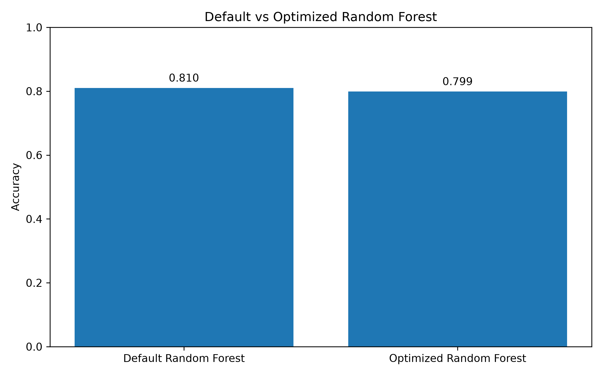

# Day 23 – Hyperparameter Tuning with Random Forest

## 📌 Project Overview

This project focuses on Hyperparameter Tuning using a Random Forest Classifier.

The Titanic dataset was used to compare a default Random Forest model with an optimized Random Forest model. GridSearchCV was used to find the best combination of hyperparameters and evaluate whether tuning improved the model's performance.

---

## 🎯 Objective

* Train a baseline Random Forest model.
* Evaluate the baseline model using appropriate metrics.
* Perform Hyperparameter Tuning using GridSearchCV.
* Find the best hyperparameter combination.
* Train an optimized Random Forest model.
* Compare the baseline and optimized models.
* Calculate performance improvement.
* Analyze the effect of hyperparameter tuning.

---

## 📊 Dataset

The Titanic dataset was used for this project.

**Dataset Shape:** `(891, 12)`

**Target Variable:** `Survived`

The dataset contains information about passengers including:

* Passenger Class
* Sex
* Age
* Fare
* Embarked
* Survival Status

---

## 🛠️ Technologies Used

* Python
* Pandas
* Scikit-Learn
* Matplotlib
* Random Forest Classifier
* GridSearchCV
* VS Code
* Git
* GitHub

---

## 🔄 Data Preprocessing

The following preprocessing steps were performed:

1. Removed unnecessary columns:

   * PassengerId
   * Name
   * Ticket
   * Cabin

2. Filled missing Age values using the median.

3. Filled missing Embarked values using the mode.

4. Converted categorical variables into numerical values using one-hot encoding.

5. Split the dataset into training and testing sets.

### Training and Testing Data

* **Training Data:** 712 rows
* **Testing Data:** 179 rows

---

## 🌲 Baseline Random Forest

A Random Forest Classifier with default parameters was trained as the baseline model.

### Baseline Performance

| Metric    |  Score |
| --------- | -----: |
| Accuracy  | 0.8101 |
| Precision | 0.7869 |
| Recall    | 0.6957 |
| F1 Score  | 0.7385 |

### Baseline Confusion Matrix

```text
[[97 13]
 [21 48]]
```

---

## 🔧 Hyperparameter Tuning

GridSearchCV was used to optimize the Random Forest model.

The following parameters were tuned:

* `n_estimators`
* `max_depth`
* `min_samples_split`
* `min_samples_leaf`

### Parameter Grid

```python
param_grid = {
    "n_estimators": [100, 200],
    "max_depth": [None, 5, 10],
    "min_samples_split": [2, 5],
    "min_samples_leaf": [1, 2]
}
```

A **5-fold cross-validation** strategy was used.

---

## ⭐ Best Parameters

GridSearchCV identified the following best parameters:

```text
max_depth = 5
min_samples_leaf = 2
min_samples_split = 5
n_estimators = 200
```

### Best Cross-Validation Score

**0.8301**

The best cross-validation accuracy was **83.01%**.

---

## 🚀 Optimized Random Forest

The Random Forest model was retrained using the best parameters found by GridSearchCV.

### Optimized Performance

| Metric    |  Score |
| --------- | -----: |
| Accuracy  | 0.7989 |
| Precision | 0.8367 |
| Recall    | 0.5942 |
| F1 Score  | 0.6949 |

### Optimized Confusion Matrix

```text
[[102   8]
 [ 28  41]]
```

---

## 📈 Model Comparison

| Model                   | Accuracy | Precision | Recall | F1 Score |
| ----------------------- | -------: | --------: | -----: | -------: |
| Default Random Forest   |   0.8101 |    0.7869 | 0.6957 |   0.7385 |
| Optimized Random Forest |   0.7989 |    0.8367 | 0.5942 |   0.6949 |

---

## 📊 Performance Improvement

### Baseline Accuracy

**81.01%**

### Optimized Accuracy

**79.89%**

### Improvement

**-1.12%**

The optimized model's test accuracy was **1.12 percentage points lower** than the baseline model.

Therefore, in this experiment, the baseline Random Forest performed better on the test dataset.

---

## 📸 Program Output

The following screenshot shows the complete program output including the baseline results, hyperparameter tuning results, best parameters, optimized model results, and performance comparison.

**Add your program output screenshot here:**

```text

```

---

## 📉 Accuracy Comparison Graph

The following graph compares the accuracy of the Default Random Forest and Optimized Random Forest.

**Add your accuracy comparison graph here:**

```text

```

---

## 🔍 Results Analysis

Hyperparameter tuning did not improve the final test accuracy in this experiment.

The Default Random Forest achieved an accuracy of **81.01%**, while the Optimized Random Forest achieved **79.89%**.

Although the optimized model had a lower test accuracy, GridSearchCV achieved a best cross-validation score of **83.01%**.

The optimized model improved Precision from **78.69% to 83.67%**.

However, Recall decreased from **69.57% to 59.42%**, and the F1 Score decreased from **73.85% to 69.49%**.

This indicates that tuning changed the model's prediction behavior but did not produce better overall test accuracy.

---

## 💡 Effect of Hyperparameters

### `n_estimators = 200`

The optimized model uses **200 decision trees**. More trees can provide more stable predictions.

### `max_depth = 5`

The maximum depth was limited to **5**. This makes the trees simpler and can help reduce overfitting.

### `min_samples_split = 5`

A minimum of **5 samples** is required to split an internal node.

### `min_samples_leaf = 2`

Each leaf must contain at least **2 samples**. This helps prevent overly specific tree branches.

---

## 🧠 Key Learnings

Through this project, I learned:

* How Random Forest hyperparameters affect model performance.
* How to use GridSearchCV for Hyperparameter Tuning.
* How to select the best hyperparameter combination.
* How to compare baseline and optimized models.
* How to evaluate models using Accuracy, Precision, Recall, and F1 Score.
* That hyperparameter tuning does not always improve test performance.
* The importance of cross-validation and testing on unseen data.

---

## 📁 Project Structure

```text
Day-23-Hyperparameter-Tuning-Random-Forest/
│
├── train.csv
├── hyperparameter_tuning.py
├── rf_tuning_comparison.png
├── tuning_results.png
└── README.md
```

---

## ▶️ How to Run the Project

### 1. Open the project folder

Open the Day-23 project folder in VS Code.

### 2. Activate the virtual environment

```powershell
.\.venv\Scripts\Activate.ps1
```

### 3. Run the Python program

```powershell
python hyperparameter_tuning.py
```

### 4. Check the output

The program will display:

* Dataset information
* Baseline Random Forest performance
* GridSearchCV results
* Best hyperparameters
* Best cross-validation score
* Optimized Random Forest performance
* Model comparison
* Performance improvement

The generated graphs are saved in the project folder.

---

## ✅ Conclusion

The Random Forest model was successfully optimized using GridSearchCV.

The best parameter combination was:

```text
max_depth = 5
min_samples_leaf = 2
min_samples_split = 5
n_estimators = 200
```

The optimized model achieved a cross-validation score of **83.01%**.

However, on the final test dataset, the baseline model achieved **81.01% accuracy**, while the optimized model achieved **79.89% accuracy**.

Therefore, the baseline model performed better in terms of test accuracy for this particular experiment.

This project demonstrated that hyperparameter tuning is an important Machine Learning technique, but the optimized model should always be evaluated on unseen test data.

---

## 🏁 Project Status

**Day 23 – Hyperparameter Tuning with Random Forest: COMPLETED ✅**
