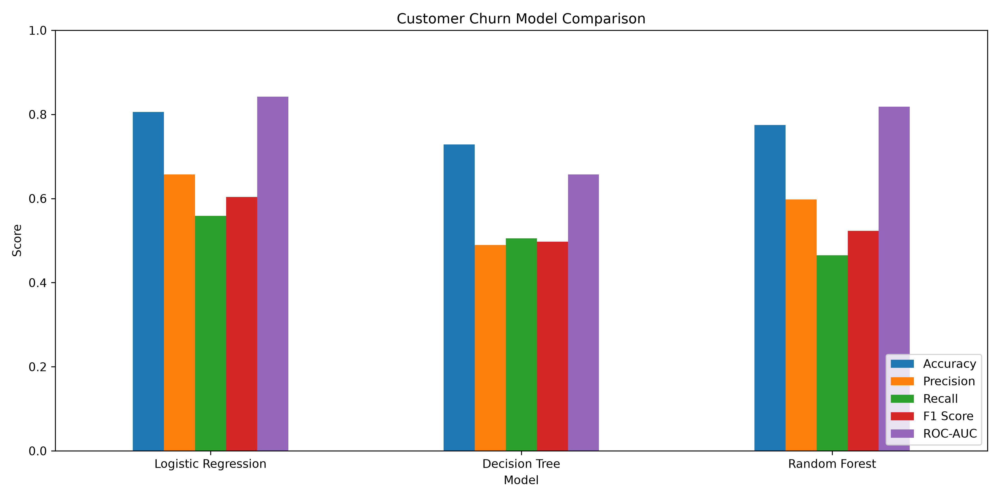
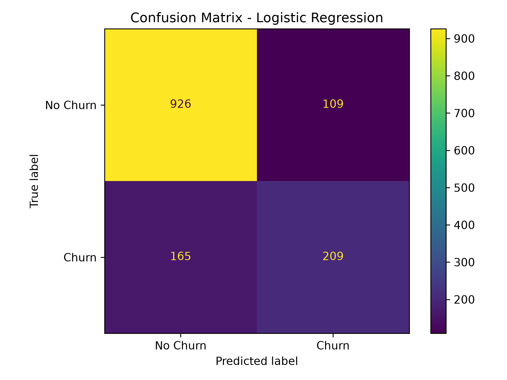
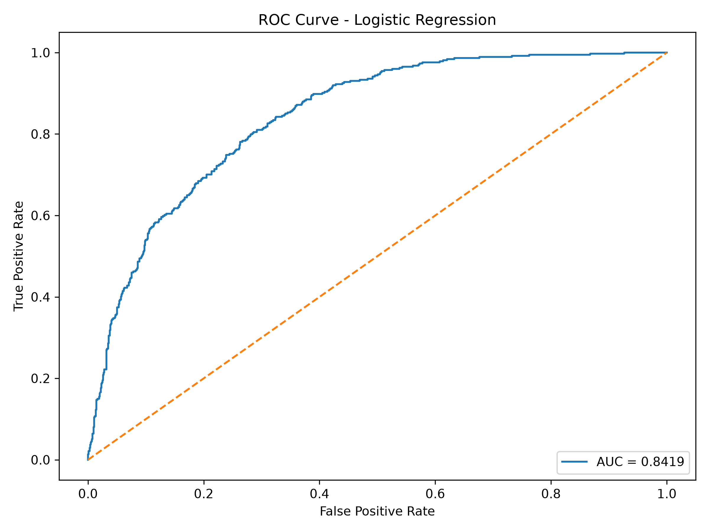
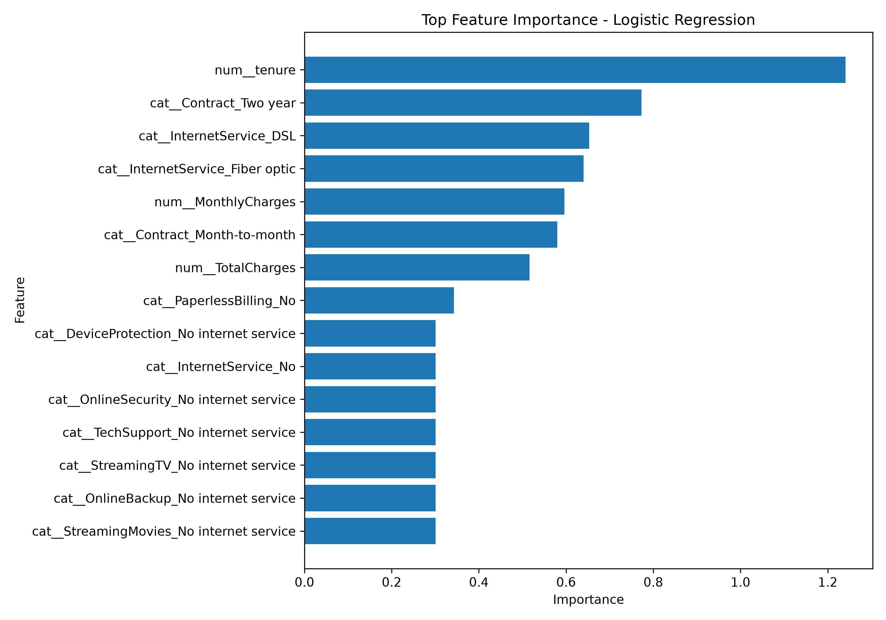

# Day 24 – Customer Churn Prediction

## 📌 Project Overview

This project focuses on predicting customer churn using Machine Learning classification models.

The Telco Customer Churn dataset was used to analyze customer information and predict whether a customer is likely to leave the service.

Three different classification models were trained and compared:

* Logistic Regression
* Decision Tree
* Random Forest

The models were evaluated using Accuracy, Precision, Recall, F1 Score, and ROC-AUC.

---

## 🎯 Objective

The main objectives of this project are:

* Load and explore the Customer Churn dataset.
* Clean and preprocess the data.
* Handle missing and categorical values.
* Convert categorical variables into numerical features.
* Train multiple classification models.
* Compare model performance.
* Identify the best-performing model.
* Generate evaluation visualizations.
* Analyze important features affecting customer churn.

---

## 📊 Dataset Information

The dataset contains customer information from a telecommunications company.

### Dataset Shape

```text
Rows: 7043
Columns: 21
```

### Main Columns

* customerID
* gender
* SeniorCitizen
* Partner
* Dependents
* tenure
* PhoneService
* MultipleLines
* InternetService
* OnlineSecurity
* OnlineBackup
* DeviceProtection
* TechSupport
* StreamingTV
* StreamingMovies
* Contract
* PaperlessBilling
* PaymentMethod
* MonthlyCharges
* TotalCharges
* Churn

The target variable is:

```text
Churn
```

Where:

* `No` = Customer stays
* `Yes` = Customer churns

---

## 🧹 Data Preprocessing

The following preprocessing steps were performed:

### 1. Remove Customer ID

The `customerID` column was removed because it is an identifier and does not provide useful predictive information.

### 2. Convert TotalCharges

The `TotalCharges` column was converted from text to numeric values.

Invalid or missing values were converted to `NaN`.

### 3. Handle Missing Values

Missing values in `TotalCharges` were replaced using the median value.

### 4. Encode Target Variable

The `Churn` column was converted into binary values:

```text
No  → 0
Yes → 1
```

### 5. Categorical Encoding

Categorical features were converted into numerical features using One-Hot Encoding.

### 6. Feature Scaling

Numerical features were standardized using `StandardScaler`.

---

## 🔢 Features

### Numerical Features

```text
SeniorCitizen
tenure
MonthlyCharges
TotalCharges
```

### Categorical Features

```text
gender
Partner
Dependents
PhoneService
MultipleLines
InternetService
OnlineSecurity
OnlineBackup
DeviceProtection
TechSupport
StreamingTV
StreamingMovies
Contract
PaperlessBilling
PaymentMethod
```

---

## ✂️ Train-Test Split

The dataset was divided into training and testing sets.

```text
Training Data Shape: (5634, 19)
Testing Data Shape: (1409, 19)
```

The test size was set to 20%.

A random state of `42` was used for reproducibility.

Stratified splitting was used to maintain the class distribution of the target variable.

---

## 🤖 Machine Learning Models

### 1. Logistic Regression

Logistic Regression was used as a baseline classification model.

```python
LogisticRegression(max_iter=1000)
```

### 2. Decision Tree

Decision Tree was used to capture non-linear relationships in the dataset.

```python
DecisionTreeClassifier(random_state=42)
```

### 3. Random Forest

Random Forest was used as an ensemble learning method.

```python
RandomForestClassifier(
    n_estimators=200,
    random_state=42
)
```

---

## 📈 Model Evaluation Results

The models were evaluated using:

* Accuracy
* Precision
* Recall
* F1 Score
* ROC-AUC

| Model               | Accuracy | Precision | Recall | F1 Score |    ROC-AUC |
| ------------------- | -------: | --------: | -----: | -------: | ---------: |
| Logistic Regression |   80.55% |    65.72% | 55.88% |   60.40% | **84.19%** |
| Decision Tree       |   72.89% |    48.96% | 50.53% |   49.74% |     65.73% |
| Random Forest       |   77.50% |    59.79% | 46.52% |   52.33% |     81.87% |

---

## 🏆 Best Model

Based on the F1 Score, **Logistic Regression** was selected as the best-performing model.

### Logistic Regression Performance

```text
Accuracy  : 0.8055
Precision : 0.6572
Recall    : 0.5588
F1 Score  : 0.6040
ROC-AUC   : 0.8419
```

Logistic Regression also achieved the highest ROC-AUC score of approximately **84.19%**, indicating strong ability to distinguish between customers who churn and those who do not.

---

## 📊 Model Comparison

The following graph compares the performance of all three models across the evaluation metrics.

### Model Comparison Graph



---

## 📌 Confusion Matrix

The confusion matrix shows the classification performance of the selected Logistic Regression model.

It displays:

* True Negatives
* False Positives
* False Negatives
* True Positives

### Confusion Matrix



---

## 📈 ROC Curve

The ROC curve shows the ability of the model to distinguish between churn and non-churn customers.

The Logistic Regression model achieved:

```text
ROC-AUC = 0.8419
```

### ROC Curve



---

## ⭐ Feature Importance

Since Logistic Regression was selected as the best model, feature importance was calculated using the absolute values of its model coefficients.

The graph shows the features with the strongest influence on the prediction.

### Feature Importance Graph



---

## 💾 Experiment Results

The model evaluation results were saved in:

```text
experiment_results.csv
```

This file contains the performance metrics of all three models.

---

## 📁 Project Structure

```text
Day-24-Customer-Churn-Prediction/
│
├── customer_churn.py
├── train.csv
├── experiment_results.csv
├── model_comparison.png
├── confusion_matrix.png
├── roc_curve.png
├── feature_importance.png
└── README.md
```

---

## 🛠️ Technologies Used

* Python
* Pandas
* NumPy
* Scikit-learn
* Matplotlib
* VS Code
* Git
* GitHub

---

## 📦 Python Libraries

The project uses the following libraries:

```python
import pandas as pd
import numpy as np
import matplotlib.pyplot as plt

from sklearn.model_selection import train_test_split
from sklearn.compose import ColumnTransformer
from sklearn.pipeline import Pipeline
from sklearn.preprocessing import OneHotEncoder, StandardScaler
from sklearn.impute import SimpleImputer

from sklearn.linear_model import LogisticRegression
from sklearn.tree import DecisionTreeClassifier
from sklearn.ensemble import RandomForestClassifier

from sklearn.metrics import (
    accuracy_score,
    precision_score,
    recall_score,
    f1_score,
    confusion_matrix,
    ConfusionMatrixDisplay,
    roc_curve,
    roc_auc_score
)
```

---

## ▶️ How to Run

Open PowerShell in the project folder and run:

```powershell
& "C:\Users\ztech.pk\Documents\AI ML Internship\.venv\Scripts\python.exe" customer_churn.py
```

The program will train the models and generate the following files:

```text
experiment_results.csv
model_comparison.png
confusion_matrix.png
roc_curve.png
feature_importance.png
```

---

## 🔍 Key Findings

* Logistic Regression achieved the highest overall performance among the tested models.
* Logistic Regression achieved **80.55% accuracy**.
* Logistic Regression achieved the highest **ROC-AUC of 84.19%**.
* Decision Tree produced the lowest overall performance.
* Random Forest performed better than Decision Tree but lower than Logistic Regression for this experiment.
* Customer churn can be predicted using demographic, service, contract, tenure, and billing-related information.

---

## 📚 Learning Outcomes

Through this project, the following concepts were practiced:

* Customer churn prediction
* Classification
* Data preprocessing
* Handling missing values
* One-Hot Encoding
* Feature scaling
* Train-test splitting
* Logistic Regression
* Decision Tree
* Random Forest
* Model comparison
* Confusion Matrix
* ROC Curve
* ROC-AUC
* Feature importance
* Saving model evaluation results
* Data visualization

---

## ✅ Conclusion

This project demonstrated how Machine Learning can be used to predict customer churn.

Three classification algorithms were trained and evaluated. Logistic Regression provided the best results in this experiment, achieving an accuracy of **80.55%** and an ROC-AUC score of **84.19%**.

The generated evaluation graphs provide additional insight into model performance and the factors contributing to customer churn.

---

## 👩‍💻 Internship Task

**Day:** 24
**Project:** Customer Churn Prediction
**Focus:** Classification Model Comparison and Performance Analysis
