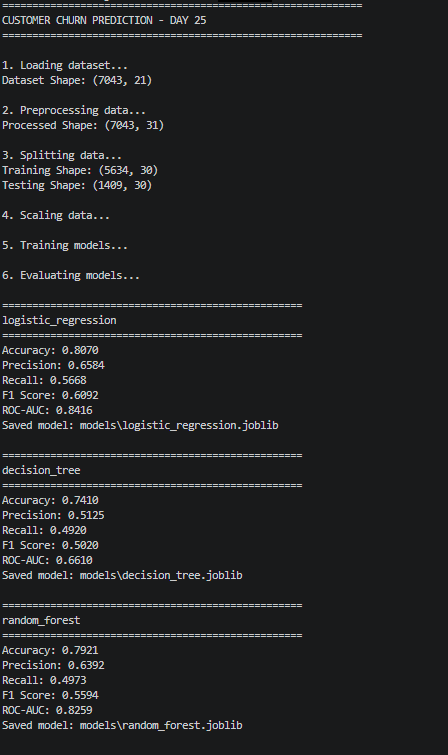

# Day 25 – Professional Machine Learning Project

## 📌 Project Title

**Customer Churn Prediction – Professional ML Project**

---

## 🎯 Objective

The objective of this project is to convert the previous Customer Churn Prediction project into a **professional and modular Machine Learning project structure**.

The project separates:

* Data preprocessing
* Data splitting
* Feature scaling
* Model training
* Model evaluation
* Configuration
* Trained model storage
* Testing

This makes the project easier to maintain, reuse, and extend.

---

## 📂 Project Structure

```text
Day-25-Professional-ML-Project/
│
├── configs/
│   └── config.py
│
├── data/
│   └── train.csv
│
├── models/
│   ├── train_model.py
│   ├── logistic_regression.joblib
│   ├── decision_tree.joblib
│   └── random_forest.joblib
│
├── src/
│   └── customer_churn/
│       ├── __init__.py
│       ├── customer_churn.py
│       ├── preprocessing.py
│       ├── evaluation.py
│       └── customer_churn_backup.py
│
├── tests/
│
├── Day-25-output.png
├── Day-25-final model results.png
└── README.md
```

---

## 📊 Dataset

The project uses the **Telco Customer Churn dataset**.

### Dataset Information

* Total Rows: **7043**
* Original Columns: **21**
* Target Column: **Churn**

### Target Variable

* `Yes` → `1`
* `No` → `0`

---

## 🔧 Data Preprocessing

The following preprocessing steps were performed:

1. Removed `customerID`.
2. Converted `TotalCharges` into numeric format.
3. Handled missing `TotalCharges` values using the median.
4. Converted the target variable `Churn` into numerical values.
5. Converted categorical variables using One-Hot Encoding.
6. Split the data into training and testing sets.
7. Applied `StandardScaler` to scale the features.

### Processed Dataset

```text
Original Shape: 7043 × 21
Processed Shape: 7043 × 31
```

### Train-Test Split

```text
Training Shape: (5634, 30)
Testing Shape:  (1409, 30)
```

---

## 🤖 Machine Learning Models

Three classification models were trained:

### 1. Logistic Regression

Logistic Regression was used as a baseline classification model for predicting customer churn.

### 2. Decision Tree

Decision Tree was used to learn decision rules from the customer data.

### 3. Random Forest

Random Forest was used as an ensemble learning model consisting of multiple decision trees.

---

## 📈 Model Evaluation

The models were evaluated using:

* Accuracy
* Precision
* Recall
* F1 Score
* ROC-AUC

---

## 🖥️ Program Output

The complete project execution output is shown below.



---

## 📊 Final Model Results

| Model               | Accuracy | Precision | Recall | F1 Score |    ROC-AUC |
| ------------------- | -------: | --------: | -----: | -------: | ---------: |
| Logistic Regression |   80.70% |    65.84% | 56.68% |   60.92% | **84.16%** |
| Decision Tree       |   74.10% |    51.25% | 49.20% |   50.20% |     66.10% |
| Random Forest       |   79.21% |    63.92% | 49.73% |   55.94% |     82.59% |

---

## 📸 Final Model Comparison Screenshot


---

## 🏆 Best Performing Model

Based on the evaluation results:

**Logistic Regression** performed the best among the three models.

### Best Results

* Accuracy: **80.70%**
* Precision: **65.84%**
* Recall: **56.68%**
* F1 Score: **60.92%**
* ROC-AUC: **84.16%**

The Logistic Regression model achieved the highest **F1 Score** and **ROC-AUC** among the tested models.

---

## 💾 Saved Models

The trained models were saved using the `joblib` library:

```text
models/logistic_regression.joblib
models/decision_tree.joblib
models/random_forest.joblib
```

---

## ⚙️ Configuration

Project configuration is maintained separately in:

```text
configs/config.py
```

It contains:

* Dataset path
* Model path
* Test size
* Random state
* Random Forest estimators
* Target column

---

## 🧩 Modular Architecture

The project follows a modular structure.

### `preprocessing.py`

Responsible for:

* Loading data
* Cleaning data
* Encoding categorical variables
* Splitting data
* Scaling features

### `train_model.py`

Responsible for:

* Training Logistic Regression
* Training Decision Tree
* Training Random Forest
* Saving trained models

### `evaluation.py`

Responsible for:

* Calculating evaluation metrics
* Printing model performance

### `customer_churn.py`

Acts as the **main pipeline** and connects all project components.

---

## ▶️ How to Run the Project

Activate the virtual environment:

```powershell
.\.venv\Scripts\Activate.ps1
```

Navigate to the Day-25 project:

```powershell
cd "C:\Users\ztech.pk\Documents\AI ML Internship\ProEdgeSolutions\Day-25-Professional-ML-Project"
```

Run the project using:

```powershell
python -m src.customer_churn.customer_churn
```

> Note: The project is run as a Python module so that the package imports such as `configs` and `src.customer_churn` work correctly.

---

## 🛠️ Technologies Used

* Python
* Pandas
* Scikit-learn
* Joblib
* Matplotlib
* VS Code
* Git & GitHub

---

## 📚 Key Learning Outcomes

Through this project, I learned:

* How to structure a professional ML project.
* How to separate preprocessing from model training.
* How to create reusable Python modules.
* How to manage project configuration.
* How to train multiple classification models.
* How to evaluate classification models.
* How to save trained models using Joblib.
* How to organize ML projects for GitHub.
* How to run a modular ML pipeline.

---

## ✅ Project Status

**Day-25 Professional ML Project – Completed Successfully 🎉**

The Customer Churn Prediction project was successfully converted into a structured and modular Machine Learning project with preprocessing, model training, evaluation, configuration, and saved models.
