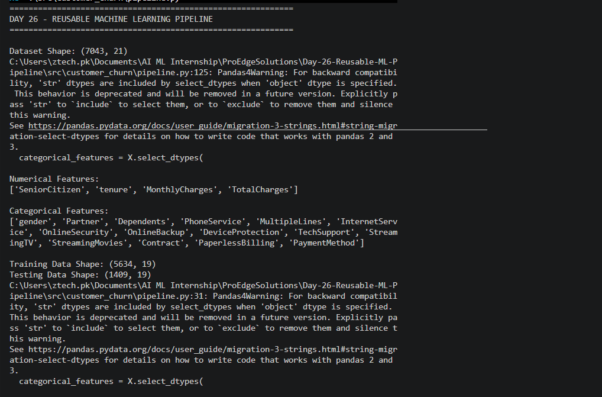
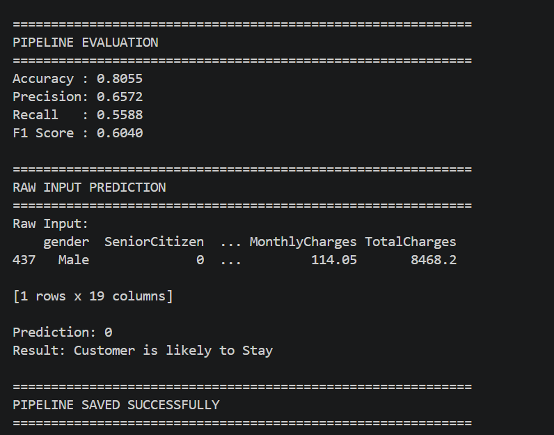

# Day 26 – Reusable Machine Learning Pipeline

## Project Title

**Customer Churn Prediction – Reusable Machine Learning Pipeline**

## Objective

The objective of this project is to build a reusable Machine Learning pipeline using Scikit-Learn `Pipeline` and `ColumnTransformer`.

The pipeline accepts raw customer data, automatically performs preprocessing, and generates predictions without requiring manual preprocessing steps.

## Dataset

The project uses the Telco Customer Churn dataset from a previous Customer Churn Prediction project.

* Dataset file: `train.csv`
* Total records: **7,043**
* Total columns: **21**
* Target variable: `Churn`

The `customerID` column was removed because it is an identifier and does not provide useful information for prediction.

## Features

### Numerical Features

* SeniorCitizen
* tenure
* MonthlyCharges
* TotalCharges

### Categorical Features

* gender
* Partner
* Dependents
* PhoneService
* MultipleLines
* InternetService
* OnlineSecurity
* OnlineBackup
* DeviceProtection
* TechSupport
* StreamingTV
* StreamingMovies
* Contract
* PaperlessBilling
* PaymentMethod

## Data Preprocessing

The preprocessing is completely automated inside the Machine Learning pipeline.

### Numerical Preprocessing

1. Missing values are handled using `SimpleImputer` with the median strategy.
2. Numerical features are scaled using `StandardScaler`.

### Categorical Preprocessing

1. Missing values are handled using `SimpleImputer` with the most frequent strategy.
2. Categorical features are converted into numerical form using `OneHotEncoder`.
3. `handle_unknown="ignore"` allows the pipeline to process previously unseen categories.

## ColumnTransformer

`ColumnTransformer` is used to apply different preprocessing steps to numerical and categorical features.

```text
                    Raw Data
                       |
                ColumnTransformer
                 /             \
                /               \
       Numerical Features   Categorical Features
              |                    |
        Median Imputer       Most Frequent Imputer
              |                    |
       StandardScaler        OneHotEncoder
                \              /
                 \            /
                  ML Pipeline
                       |
              Logistic Regression
                       |
                   Prediction
```

## Machine Learning Pipeline

The complete workflow is implemented using Scikit-Learn `Pipeline`.

The pipeline combines:

* Data preprocessing
* Missing value handling
* Feature scaling
* Categorical encoding
* Logistic Regression

This allows the entire workflow to be trained using a single command:

```python
pipeline.fit(X_train, y_train)
```

Predictions can then be generated directly from raw input data:

```python
pipeline.predict(raw_input)
```

## Model

**Logistic Regression**

The model was configured with:

```python
LogisticRegression(
    max_iter=1000,
    random_state=42
)
```

## Train-Test Split

The dataset was divided into:

* Training data: **5,634 rows**
* Testing data: **1,409 rows**
* Test size: **20%**
* Random state: **42**
* Stratification: Used

## Model Evaluation

The pipeline was evaluated using Accuracy, Precision, Recall, and F1 Score.

| Metric    |      Score |
| --------- | ---------: |
| Accuracy  | **80.55%** |
| Precision | **65.72%** |
| Recall    | **55.88%** |
| F1 Score  | **60.40%** |

## Raw Input Prediction

The trained pipeline was tested using raw customer input data.

The pipeline automatically performed all required preprocessing before generating the prediction.

Example prediction:

```text
Prediction: 0
Result: Customer is likely to Stay
```

This demonstrates that the pipeline can accept raw input without manually applying encoding or scaling.

## Comparison with Previous Implementation

The Day 25 Customer Churn project used separate preprocessing functions for:

* Missing value handling
* One-hot encoding
* Feature scaling
* Train-test preparation

In Day 26, these steps were integrated into a single reusable pipeline.

| Feature                | Day 25  | Day 26    |
| ---------------------- | ------- | --------- |
| Missing value handling | Manual  | Automated |
| Encoding               | Manual  | Pipeline  |
| Scaling                | Manual  | Pipeline  |
| ColumnTransformer      | No      | Yes       |
| Scikit-Learn Pipeline  | No      | Yes       |
| Raw input prediction   | Limited | Supported |
| Reusable workflow      | Partial | Yes       |

The Day 26 pipeline achieved the same evaluation results as the previous Logistic Regression implementation:

* Accuracy: **80.55%**
* Precision: **65.72%**
* Recall: **55.88%**
* F1 Score: **60.40%**

## Key Observations

1. The complete preprocessing and model training workflow is now automated.
2. `ColumnTransformer` allows numerical and categorical features to receive appropriate transformations.
3. `Pipeline` reduces the need for manual preprocessing.
4. `OneHotEncoder(handle_unknown="ignore")` makes the pipeline more robust when new categorical values appear.
5. The trained pipeline can directly generate predictions from raw input data.
6. The complete pipeline was successfully saved as a `.joblib` file.

## Saved Model

The trained pipeline was saved as:

```text
models/churn_pipeline.joblib
```

This file contains both the preprocessing steps and the trained Logistic Regression model.

## Project Structure

```text
Day-26-Reusable-ML-Pipeline/
│
├── configs/
│
├── data/
│   └── train.csv
│
├── models/
│   └── churn_pipeline.joblib
│
├── src/
│   └── customer_churn/
│       ├── pipeline.py
│       └── __init__.py
│
├── tests/
│
├── Day-26-pipeline-output-1.png
├── Day-26-pipeline-output-2.png
└── README.md
```

## Screenshots

### Pipeline Output – Part 1



### Pipeline Output – Part 2



## Conclusion

The Day 26 task successfully implemented a reusable Machine Learning pipeline using Scikit-Learn `Pipeline` and `ColumnTransformer`.

The pipeline automatically handles missing values, numerical scaling, categorical encoding, model training, and prediction in a single workflow.

This makes the Machine Learning project more **reusable, maintainable, and production-ready** compared with the manual preprocessing approach used previously.
