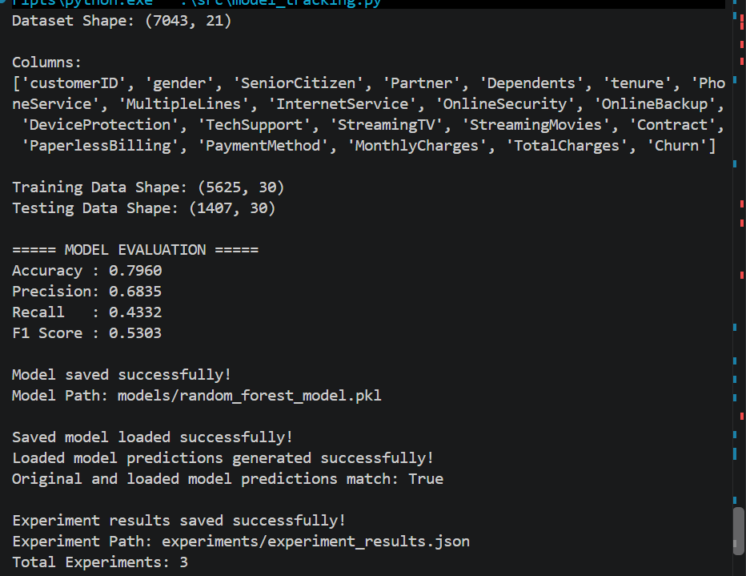

# Day 27 – Model Saving & Experiment Tracking

## Objective

The objective of this project is to learn how trained Machine Learning models can be saved, loaded, reused, and tracked for reproducibility and future use.

This project implements a Model Saving & Experiment Tracking System using the **Telco Customer Churn Dataset** and a **Random Forest Classifier**.

---

## Task

The project demonstrates:

* Training a Machine Learning model
* Saving the trained model using Joblib
* Loading the saved model
* Generating predictions using the loaded model
* Verifying that loaded-model predictions match the original model
* Recording model parameters and evaluation metrics
* Maintaining experiment history in JSON format
* Organizing models, experiments, data, source code, and screenshots

---

## Dataset

**Dataset:** Telco Customer Churn Dataset

* Rows: 7043
* Original Columns: 21
* Target Variable: `Churn`

The `customerID` column was removed because it does not provide useful predictive information.

`TotalCharges` was converted to numeric values and missing values were removed.

Categorical features were converted using one-hot encoding.

---

## Model

**Algorithm:** Random Forest Classifier

### Model Parameters

```text
n_estimators = 200
max_depth = 5
min_samples_split = 5
min_samples_leaf = 2
random_state = 42
```

### Model Version

```text
v1.0
```

---

## Data Split

The dataset was divided into training and testing sets using an 80/20 split.

```text
Training Data: 5625 rows
Testing Data: 1407 rows
Features: 30
```

---

## Model Evaluation

The trained Random Forest model achieved the following results:

| Metric    |  Score |
| --------- | -----: |
| Accuracy  | 79.60% |
| Precision | 68.35% |
| Recall    | 43.32% |
| F1 Score  | 53.03% |

---

## Model Saving

The trained model was saved using **Joblib**.

Saved model:

```text
models/random_forest_model.pkl
```

Joblib allows the trained model to be stored and reused without retraining it every time.

---

## Model Loading

The saved Random Forest model was successfully loaded using Joblib.

The loaded model was then used to generate predictions on the test dataset.

The predictions from the original model and the loaded model were compared.

```text
Original and loaded model predictions match: True
```

This verifies that the saved model can be successfully restored and used for predictions.

---

## Experiment Tracking

Experiment information is stored in:

```text
experiments/experiment_results.json
```

The experiment record contains:

* Model name
* Training date
* Dataset name
* Model version
* Model parameters
* Evaluation metrics
* Model path
* Prediction verification result

Multiple training runs are preserved as experiment history.

---

## Project Structure

```text
Day-27-Model-Saving-Experiment-Tracking/
│
├── data/
│   └── train.csv
│
├── experiments/
│   └── experiment_results.json
│
├── models/
│   └── random_forest_model.pkl
│
├── screenshots/
│   └── Day-27-Program-output.png
│
├── src/
│   └── model_tracking.py
│
└── README.md
```

---

## Technologies Used

* Python
* Pandas
* Scikit-learn
* Joblib
* JSON
* PowerShell
* VS Code
* Git & GitHub

---

## Workflow

```text
Load Dataset
     ↓
Data Preprocessing
     ↓
Train/Test Split
     ↓
Train Random Forest
     ↓
Evaluate Model
     ↓
Save Model using Joblib
     ↓
Load Saved Model
     ↓
Generate Predictions
     ↓
Verify Predictions
     ↓
Track Experiment
     ↓
Maintain Experiment History
```

---

## Screenshot

### Program Output



The screenshot shows model evaluation, model saving, model loading, prediction verification, and experiment tracking results.

---

## Submission Checklist

* [x] Trained Machine Learning model
* [x] Model saved using Joblib
* [x] Saved model stored in `models/`
* [x] Model loaded successfully
* [x] Predictions generated using loaded model
* [x] Loaded-model predictions verified
* [x] Model parameters recorded
* [x] Evaluation metrics recorded
* [x] Training date recorded
* [x] Dataset name recorded
* [x] Model version recorded
* [x] Experiment history maintained in JSON
* [x] Screenshot added
* [x] README updated

---

## Learning Outcome

Through this project, I learned how to:

1. Save trained Machine Learning models using Joblib.
2. Load saved models for future predictions.
3. Verify model consistency after loading.
4. Track model configurations and evaluation metrics.
5. Maintain experiment history for reproducibility.
6. Organize Machine Learning projects for model version management.

---

## Conclusion

The Day 27 project successfully implements a basic Model Saving & Experiment Tracking System. The trained Random Forest model is saved, loaded, tested for prediction consistency, and documented through a structured JSON experiment history.
