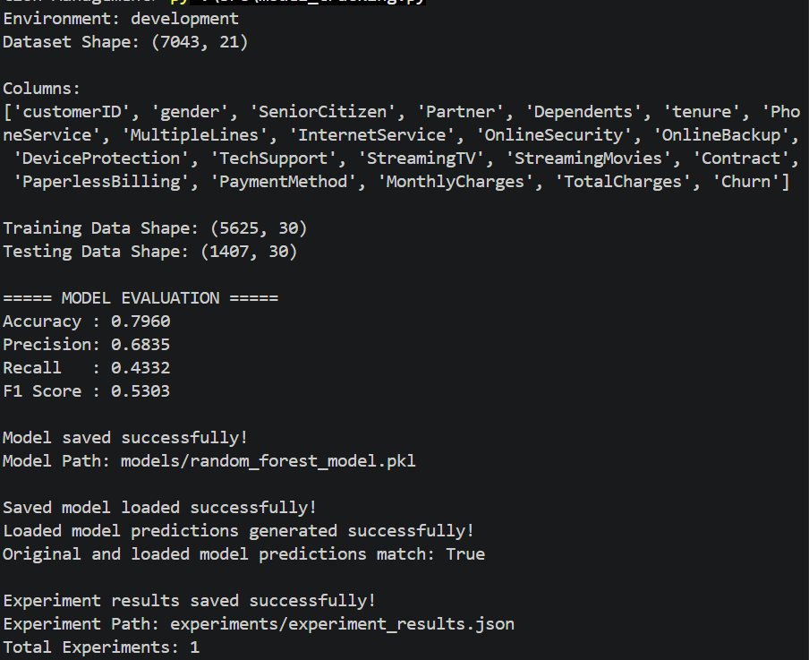

# Day 28 - Configuration Management & Environment Variables

## Objective

The objective of Day 28 is to implement Configuration Management and Environment Variables in a Machine Learning project.

The project was refactored to remove hardcoded configuration values and load important settings dynamically using a `.env` file and Python configuration module.

## Project Structure

```text
Day-28-Configuration-Management/
│
├── data/
│   └── train.csv
│
├── models/
│   └── random_forest_model.pkl
│
├── experiments/
│   └── experiment_results.json
│
├── src/
│   ├── config.py
│   └── model_tracking.py
│
├── .env
├── .gitignore
├── requirements.txt
└── Day-28-Program-output.png
```

## Configuration Management

The project uses `python-dotenv` to load configuration values from environment variables.

The following settings are configured through the `.env` file:

* Dataset Path
* Model Path
* Experiment Path
* Project Name
* Environment

Example configuration:

```text
DATASET_PATH=data/train.csv
MODEL_PATH=models/random_forest_model.pkl
PROJECT_NAME=Customer Churn Prediction
ENVIRONMENT=development
EXPERIMENT_PATH=experiments/experiment_results.json
```

## Dynamic Configuration

The `src/config.py` file loads environment variables dynamically using Python's `os` module and `python-dotenv`.

This removes the need to hardcode important paths and project settings directly inside the Machine Learning code.

## Project Refactoring

The following improvements were implemented:

* Removed hardcoded dataset path.
* Removed hardcoded model path.
* Moved project settings to environment variables.
* Added dynamic configuration loading.
* Added experiment path configuration.
* Added project name and environment settings.
* Improved project maintainability and flexibility.

## Security Practices

A `.gitignore` file was added to prevent the `.env` file from being committed to GitHub.

```text
.env
__pycache__/
```

The `.env` file should not be stored in version control.

## Dependencies

The project uses the following Python packages:

```text
pandas
numpy
scikit-learn
joblib
python-dotenv
```

Install the dependencies using:

```powershell
py -m pip install -r requirements.txt
```

## Verification

The application was successfully executed after configuration refactoring.

The application successfully:

* Loaded configuration from environment variables.
* Loaded the Telco Customer Churn dataset.
* Trained the Random Forest model.
* Evaluated the model.
* Saved the trained model.
* Loaded the saved model.
* Verified prediction consistency.
* Saved experiment results.

### Model Evaluation

```text
Accuracy : 0.7960
Precision: 0.6835
Recall   : 0.4332
F1 Score : 0.5303
```

### Prediction Verification

```text
Original and loaded model predictions match: True
```

## Screenshot

### Program Output



The screenshot shows configuration loading, dataset loading, model evaluation, model saving, model loading, prediction verification, and experiment tracking results.

## Learning Outcome

Through this task, configuration management was implemented using environment variables and a Python configuration file.

The project is now more maintainable, flexible, and suitable for different environments without changing the main application code.

## Submission Checklist

* [x] Hardcoded configuration values removed
* [x] Environment variables implemented
* [x] Dynamic configuration loading implemented
* [x] `.env` configured
* [x] `.gitignore` configured
* [x] README.md updated
* [x] Program output screenshot added
* [x] Application verified successfully
