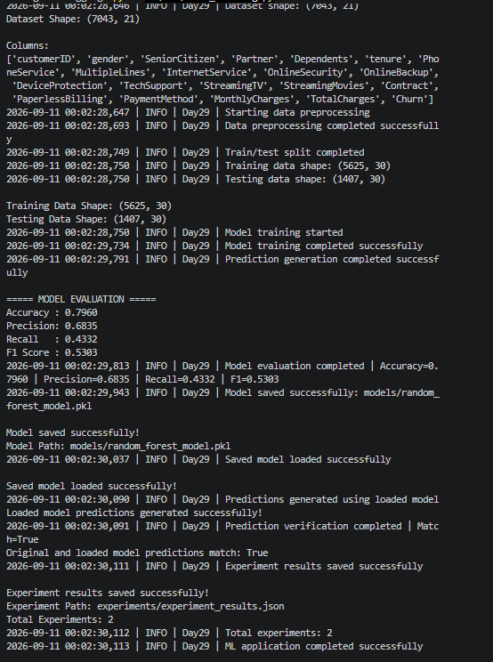
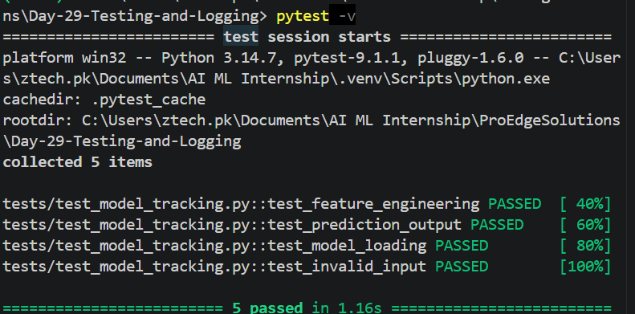
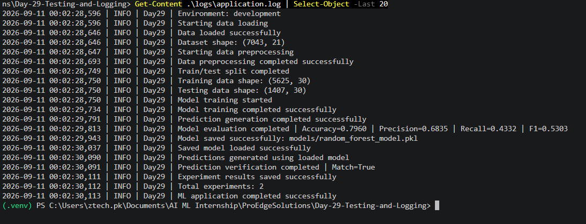

# Day 29 – Unit Testing and Structured Logging

## Overview

This project enhances the Customer Churn Prediction ML project with **Unit Testing** and **Structured Logging**.

The main objectives are to test important ML functions and maintain application logs for normal operations, warnings, and errors.

## Objectives

* Add unit tests using `pytest`
* Test data preprocessing
* Test feature engineering
* Test prediction output
* Test model loading
* Test invalid inputs
* Add structured logging using Python `logging`
* Record application startup and data loading
* Record model training and prediction
* Record errors and warnings
* Save logs in a dedicated log file

## Project Structure

```text
Day-29-Testing-and-Logging/
│
├── data/
│   └── train.csv
│
├── logs/
│   └── application.log
│
├── models/
│   └── random_forest_model.pkl
│
├── experiments/
│   └── experiment_results.json
│
├── src/
│   ├── config.py
│   ├── logging_config.py
│   └── model_tracking.py
│
├── tests/
│   └── test_model_tracking.py
│
├── .env
├── requirements.txt
└── README.md
```

## Machine Learning Program Output

The Customer Churn Prediction model was successfully trained, evaluated, saved, and loaded.

### Dataset

```text
Dataset Shape: (7043, 21)
Training Data Shape: (5625, 30)
Testing Data Shape: (1407, 30)
```

### Model Evaluation

```text
Accuracy : 0.7960
Precision: 0.6835
Recall   : 0.4332
F1 Score : 0.5303
```

The saved model predictions were successfully verified.

```text
Original and loaded model predictions match: True
```

### Program Output Screenshot



## Unit Testing

Unit tests were implemented using **pytest**.

The following areas were tested:

* Data preprocessing
* Feature engineering
* Prediction output
* Model loading
* Invalid input handling

### Test Result

```text
========================= test session starts =========================
collected 5 items

5 passed in 1.16s
```

All **5 tests passed successfully**.

### Testing Screenshot



## Structured Logging

Python's built-in `logging` module was used to implement structured application logging.

The application records:

* Application startup
* Project and environment information
* Data loading
* Data preprocessing
* Train/test split
* Model training
* Prediction generation
* Model evaluation
* Model saving
* Model loading
* Prediction verification
* Experiment tracking
* Errors and warnings

### Log Levels

| Level   | Purpose                       |
| ------- | ----------------------------- |
| INFO    | Normal application operations |
| WARNING | Unexpected situations         |
| ERROR   | Errors and exceptions         |

Logs are stored in:

```text
logs/application.log
```

### Logging Screenshot



## Model Parameters

The project uses a **Random Forest Classifier**.

```text
n_estimators = 200
max_depth = 5
min_samples_split = 5
min_samples_leaf = 2
random_state = 42
```

## Model Saving and Loading

The trained model is saved using Joblib:

```text
models/random_forest_model.pkl
```

The saved model is loaded again and its predictions are verified against the original model.

```text
Original and loaded model predictions match: True
```

## Experiment Tracking

Experiment results are stored in:

```text
experiments/experiment_results.json
```

The experiment history records:

* Project name
* Environment
* Model name
* Training date
* Dataset name
* Model version
* Model parameters
* Evaluation metrics
* Model path
* Prediction verification

## Requirements

```text
pytest
pandas
numpy
scikit-learn
joblib
python-dotenv
```

## How to Run

Activate the virtual environment:

```powershell
& "C:\Users\ztech.pk\Documents\AI ML Internship\.venv\Scripts\Activate.ps1"
```

Run unit tests:

```powershell
pytest -v
```

Run the ML application:

```powershell
python .\src\model_tracking.py
```

Check the application log:

```powershell
Get-Content .\logs\application.log
```

## Submission Checklist

* [x] Unit tests implemented
* [x] Data preprocessing tested
* [x] Feature engineering tested
* [x] Prediction output tested
* [x] Model loading tested
* [x] Invalid input tested
* [x] Structured logging implemented
* [x] INFO logging implemented
* [x] WARNING logging implemented
* [x] ERROR logging implemented
* [x] Dedicated log file created
* [x] ML model trained and evaluated
* [x] Model saved using Joblib
* [x] Saved model loaded successfully
* [x] Prediction verification completed
* [x] Experiment tracking maintained
* [x] Program output screenshot added
* [x] Testing screenshot added
* [x] Logging screenshot added
