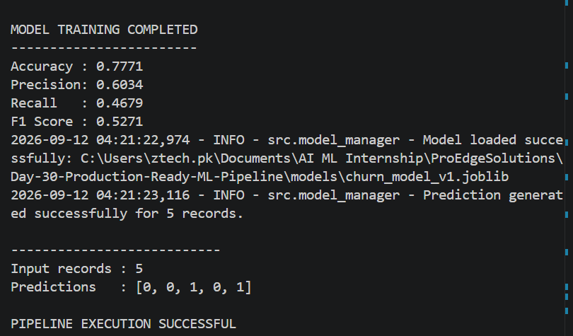

# Day 30 – Production-Ready ML Pipeline

## 📌 Project Overview

This project implements a production-ready Machine Learning pipeline for **Telco Customer Churn Prediction**.

The project combines data preprocessing, model training, evaluation, model saving and loading, prediction generation, configuration management, logging, experiment tracking, and automated testing into one reusable workflow.

## 🎯 Objectives

* Build a reusable Machine Learning pipeline
* Handle numerical and categorical data automatically
* Train a Random Forest classification model
* Evaluate model performance
* Save and load the trained model using Joblib
* Generate predictions from processed customer data
* Manage configuration using `.env`
* Implement application logging
* Track experiments and model metrics
* Add automated tests using Pytest

## 🛠️ Technologies Used

* Python
* Pandas
* NumPy
* Scikit-learn
* Joblib
* Python-dotenv
* Pytest

## 📂 Project Structure

```text
Day-30-Production-Ready-ML-Pipeline/
│
├── configs/
│   ├── .env
│   └── .env.example
│
├── data/
│   └── train.csv
│
├── experiments/
│   └── experiment_results.json
│
├── logs/
│   └── application.log
│
├── models/
│   └── churn_model_v1.joblib
│
├── screenshots/
│   └── Day-30-Program-output.png
│
├── src/
│   ├── __init__.py
│   ├── config.py
│   ├── preprocessing.py
│   ├── pipeline.py
│   ├── model_manager.py
│   ├── experiment_tracking.py
│   ├── logging_config.py
│   └── main.py
│
├── tests/
│   ├── __init__.py
│   ├── test_preprocessing.py
│   └── test_pipeline.py
│
├── .gitignore
└── requirements.txt
```

## ⚙️ Configuration

The project uses environment variables for configuration.

Example configuration:

```text
TEST_SIZE=0.2
RANDOM_STATE=42
N_ESTIMATORS=200
MODEL_VERSION=v1
TARGET_COLUMN=Churn
MODEL_NAME=RandomForest
LOG_LEVEL=INFO
```

The actual `.env` file is excluded from Git using `.gitignore`.

## 🔄 ML Pipeline

The pipeline performs the following steps:

1. Load the Telco Customer Churn dataset
2. Remove the customer ID column
3. Convert `TotalCharges` to numeric format
4. Convert the target variable into numerical values
5. Handle missing numerical values
6. Handle missing categorical values
7. Encode categorical features
8. Split the data into training and testing sets
9. Train a Random Forest classifier
10. Evaluate the model
11. Save the trained model
12. Track experiment results
13. Load the saved model
14. Generate predictions
15. Log application activities

## 🤖 Model

The project uses:

**Random Forest Classifier**

Parameters:

* `n_estimators = 200`
* `random_state = 42`

## 📊 Model Evaluation

The model achieved the following results:

| Metric    |  Score |
| --------- | -----: |
| Accuracy  | 0.7771 |
| Precision | 0.6034 |
| Recall    | 0.4679 |
| F1 Score  | 0.5271 |

## 💾 Model Saving

The trained model is saved using Joblib:

```text
models/churn_model_v1.joblib
```

The saved model is then loaded again to verify that predictions can be generated successfully.

## 🧪 Testing

Automated tests were implemented using Pytest.

The test suite verifies:

* Feature preparation
* Target conversion
* Preprocessor creation
* Pipeline training
* Prediction generation

Test result:

```text
3 passed, 2 warnings
```

## 📝 Experiment Tracking

Experiment results are stored in:

```text
experiments/experiment_results.json
```

The experiment record contains:

* Model name
* Training date
* Model version
* Model parameters
* Evaluation metrics

## 📋 Logging

Application logs are stored in:

```text
logs/application.log
```

The logging system records important events such as:

* Data loading
* Pipeline creation
* Model training
* Model evaluation
* Model saving
* Model loading
* Prediction generation

## ▶️ How to Run

Activate the virtual environment and install the required packages:

```powershell
pip install -r requirements.txt
```

Run the production pipeline:

```powershell
python -m src.main
```

Run automated tests:

```powershell
pytest -v
```

## 📸 Program Output

The following screenshot shows the complete successful execution of the production-ready ML pipeline.



## ✅ Final Result

The Day 30 project successfully demonstrates a production-ready Machine Learning workflow with:

* Reusable preprocessing
* Machine Learning pipeline
* Model training and evaluation
* Model saving and loading
* Prediction generation
* Configuration management
* Logging
* Experiment tracking
* Automated testing
* Versioned model storage
