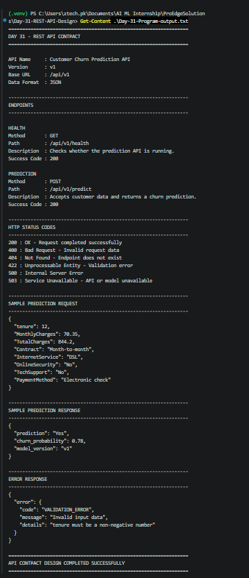

# Day 31 – REST APIs, HTTP Methods & API Design

## REST API Contract for Customer Churn Prediction

### Objective

The objective of Day 31 is to learn the fundamentals of REST APIs, HTTP methods, HTTP status codes, and JSON data exchange.

For this task, a REST API contract was designed for a **Customer Churn Prediction Machine Learning service**.

The API contract defines how clients communicate with the prediction service, what data is sent, what responses are returned, and how errors are handled.

---

## Project Structure

```text
Day-31-REST-API-Design/
│
├── src/
│   └── api_contract.py
│
├── screenshots/
│   └── Day-31-Program-output.png
│
├── Day-31-Program-output.txt
└── README.md
```

---

# API Overview

| Property    | Value                         |
| ----------- | ----------------------------- |
| API Name    | Customer Churn Prediction API |
| Version     | v1                            |
| Base URL    | `/api/v1`                     |
| Data Format | JSON                          |
| API Type    | REST API                      |

---

# 1. Health Check Endpoint

The health check endpoint verifies whether the API service is running.

### Endpoint

```text
GET /api/v1/health
```

### HTTP Method

`GET`

### Request Body

No request body is required.

### Successful Response

**Status Code: `200 OK`**

```json
{
  "status": "healthy",
  "service": "Customer Churn Prediction API",
  "version": "1.0.0"
}
```

### Response Schema

| Field   | Type   | Description        |
| ------- | ------ | ------------------ |
| status  | string | Current API status |
| service | string | API service name   |
| version | string | API version        |

---

# 2. Prediction Endpoint

The prediction endpoint accepts customer information and returns a Machine Learning churn prediction.

### Endpoint

```text
POST /api/v1/predict
```

### HTTP Method

`POST`

### Request Header

```text
Content-Type: application/json
```

---

## Request Schema

| Field           | Type   | Required | Description                              |
| --------------- | ------ | -------- | ---------------------------------------- |
| tenure          | number | Yes      | Number of months the customer has stayed |
| MonthlyCharges  | number | Yes      | Customer monthly charges                 |
| TotalCharges    | number | Yes      | Customer total charges                   |
| Contract        | string | Yes      | Customer contract type                   |
| InternetService | string | Yes      | Internet service type                    |
| OnlineSecurity  | string | Yes      | Online security subscription             |
| TechSupport     | string | Yes      | Technical support subscription           |
| PaymentMethod   | string | Yes      | Customer payment method                  |

---

## Sample Prediction Request

```json
{
  "tenure": 12,
  "MonthlyCharges": 70.35,
  "TotalCharges": 844.20,
  "Contract": "Month-to-month",
  "InternetService": "DSL",
  "OnlineSecurity": "No",
  "TechSupport": "No",
  "PaymentMethod": "Electronic check"
}
```

---

## Prediction Response Schema

| Field             | Type   | Description                   |
| ----------------- | ------ | ----------------------------- |
| prediction        | string | Predicted churn result        |
| churn_probability | number | Probability of customer churn |
| model_version     | string | Version of the ML model       |

---

## Sample Prediction Response

**Status Code: `200 OK`**

```json
{
  "prediction": "Yes",
  "churn_probability": 0.78,
  "model_version": "v1"
}
```

---

# 3. HTTP Methods

The API follows standard HTTP methods according to REST principles.

| Method | Endpoint          | Purpose                            |
| ------ | ----------------- | ---------------------------------- |
| GET    | `/api/v1/health`  | Check API health                   |
| POST   | `/api/v1/predict` | Generate customer churn prediction |

### GET

The `GET` method is used to retrieve the health status of the API.

### POST

The `POST` method is used to send customer data to the prediction service and generate a prediction.

---

# 4. HTTP Status Codes

The API uses standard HTTP status codes.

| Status Code | Meaning               | Usage                          |
| ----------- | --------------------- | ------------------------------ |
| 200         | OK                    | Request completed successfully |
| 400         | Bad Request           | Invalid request data           |
| 404         | Not Found             | Endpoint does not exist        |
| 422         | Unprocessable Entity  | Request validation failed      |
| 500         | Internal Server Error | Unexpected server error        |
| 503         | Service Unavailable   | API or ML model is unavailable |

---

# 5. Error Handling

The API returns errors in JSON format.

## Validation Error

**Status Code: `422 Unprocessable Entity`**

```json
{
  "error": {
    "code": "VALIDATION_ERROR",
    "message": "Invalid input data",
    "details": "tenure must be a non-negative number"
  }
}
```

## Bad Request

**Status Code: `400 Bad Request`**

```json
{
  "error": {
    "code": "BAD_REQUEST",
    "message": "Invalid request format"
  }
}
```

## Not Found

**Status Code: `404 Not Found`**

```json
{
  "error": {
    "code": "NOT_FOUND",
    "message": "The requested endpoint was not found"
  }
}
```

## Internal Server Error

**Status Code: `500 Internal Server Error`**

```json
{
  "error": {
    "code": "INTERNAL_SERVER_ERROR",
    "message": "An unexpected error occurred"
  }
}
```

## Service Unavailable

**Status Code: `503 Service Unavailable`**

```json
{
  "error": {
    "code": "SERVICE_UNAVAILABLE",
    "message": "Prediction service is currently unavailable"
  }
}
```

---

# 6. REST API Design Principles

The API contract follows the following REST principles:

1. Resource-oriented endpoints are used.
2. Standard HTTP methods are used.
3. JSON is used for request and response data.
4. Communication is designed to be stateless.
5. Standard HTTP status codes are used.
6. Consistent JSON error responses are provided.
7. API versioning is implemented using `/api/v1`.

---

# 7. API Request and Response Flow

### Health Check Flow

```text
Client
  |
  | GET /api/v1/health
  |
  v
Customer Churn Prediction API
  |
  | 200 OK
  |
  v
JSON Health Response
```

### Prediction Flow

```text
Client
  |
  | POST /api/v1/predict
  | JSON Customer Data
  |
  v
Customer Churn Prediction API
  |
  v
Machine Learning Model
  |
  v
Prediction Result
  |
  | 200 OK
  |
  v
JSON Prediction Response
```

---

# 8. Program Output

The API contract was successfully generated and displayed using Python.

### Program Output Screenshot



---

# 9. Implementation

The API contract is defined in:

```text
src/api_contract.py
```

The program documents:

* API name and version
* Base URL
* Health check endpoint
* Prediction endpoint
* HTTP methods
* Request schema
* Response schema
* Sample JSON request
* Sample JSON response
* HTTP status codes
* Error response structure

The contract was executed successfully using:

```powershell
python .\src\api_contract.py
```

---

# 10. Submission Checklist

* [x] REST API contract designed successfully
* [x] Health check endpoint defined
* [x] Prediction endpoint defined
* [x] Request JSON schema documented
* [x] Response JSON schema documented
* [x] Sample JSON request included
* [x] Sample JSON response included
* [x] HTTP status codes defined
* [x] Error responses documented
* [x] REST principles documented
* [x] Program output generated
* [x] Screenshot included
* [x] README updated

---

# Conclusion

The Customer Churn Prediction REST API contract successfully defines how clients communicate with the Machine Learning prediction service.

The contract includes endpoints, HTTP methods, JSON request and response schemas, sample payloads, HTTP status codes, and standardized error responses.

This API contract provides a clear foundation for implementing the actual Machine Learning prediction service in a future task.
