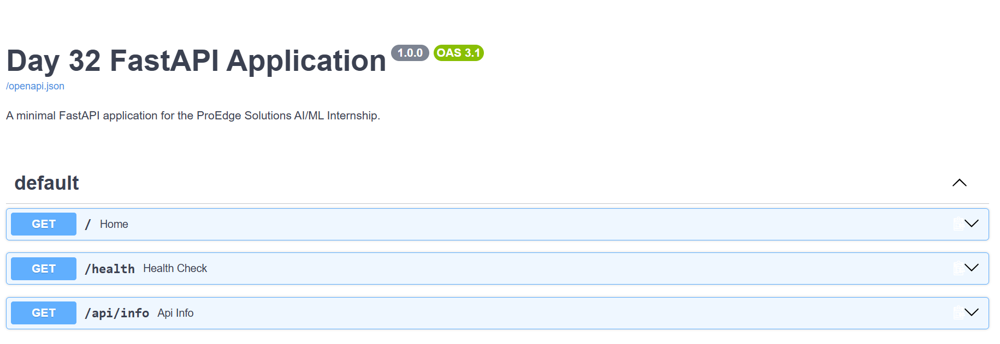
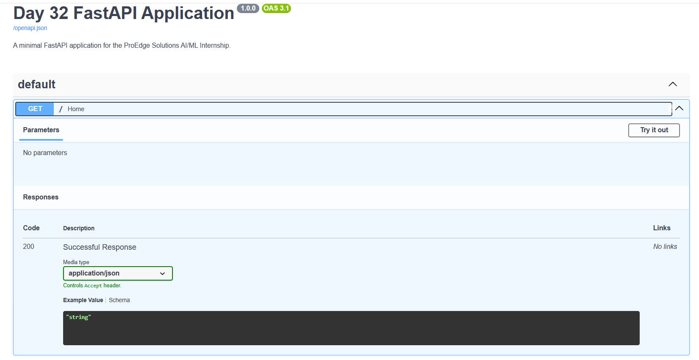
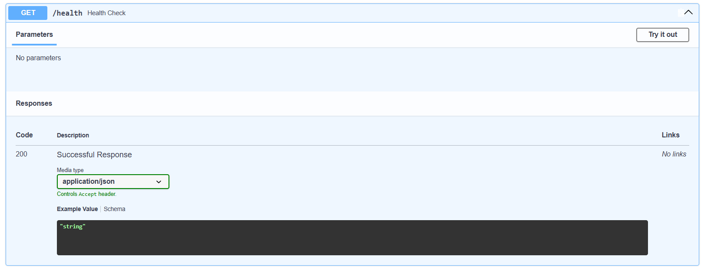
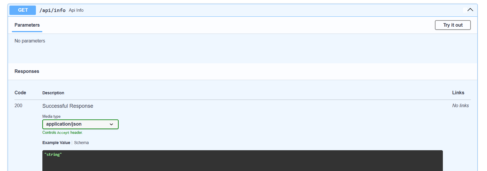

# Day 32 - Building a FastAPI Application

## Objective

The objective of Day 32 is to learn the fundamentals of FastAPI, API routing, HTTP methods, JSON responses, and automatic API documentation using Swagger UI.

## Technologies Used

* Python
* FastAPI
* Uvicorn
* Swagger UI
* REST API

## Project Structure

```text
Day-32-FastAPI-Application/
│
├── src/
│   └── main.py
│
├── screenshots/
│   ├── Day-32-Swagger-Overview.png
│   ├── Day-32-Home-Endpoint.png
│   ├── Day-32-Health-Endpoint.png
│   └── Day-32-API-Info-Endpoint.png
│
├── Day-32-Program-output.txt
├── requirements.txt
└── README.md
```

## Installation

Install the required dependencies using:

```bash
pip install -r requirements.txt
```

## Running the Application

Start the FastAPI application using Uvicorn:

```bash
python -m uvicorn src.main:app --reload
```

The application runs at:

```text
http://127.0.0.1:8000
```

## API Endpoints

### 1. Home Route

**GET /**

Returns a welcome message and application status.

Example response:

```json
{
    "message": "Welcome to Day 32 FastAPI Application",
    "status": "success"
}
```

### 2. Health Check

**GET /health**

Returns the health status of the API.

Example response:

```json
{
    "status": "healthy",
    "service": "FastAPI"
}
```

### 3. API Information

**GET /api/info**

Returns basic information about the FastAPI project.

Example response:

```json
{
    "project": "Day 32 - FastAPI Application",
    "technology": "FastAPI",
    "documentation": "/docs"
}
```

## Swagger UI Documentation

FastAPI automatically generates interactive API documentation using Swagger UI.

Open the following URL in a browser:

```text
http://127.0.0.1:8000/docs
```

The available API routes were tested using **Try it out** and **Execute** in Swagger UI.

## Swagger UI Overview



## Home Endpoint - 200 OK



## Health Endpoint - 200 OK



## API Info Endpoint - 200 OK



## Program Output

The FastAPI application was successfully tested through Swagger UI.

All three API endpoints returned **HTTP 200 OK** responses with JSON data.

Complete program output is available in:

`Day-32-Program-output.txt`

## Learning Outcomes

* Created a FastAPI application.
* Implemented API routes.
* Used HTTP GET methods.
* Returned JSON responses.
* Tested API endpoints successfully.
* Used Swagger UI for interactive API documentation.
* Learned how FastAPI automatically generates API documentation.

## Submission Checklist

* [x] FastAPI application created successfully
* [x] Home route implemented
* [x] Health check route implemented
* [x] Additional API route implemented
* [x] JSON responses verified
* [x] Swagger UI accessed and tested
* [x] Screenshots added
* [x] README.md updated
* [x] requirements.txt added
* [x] Program output documented
* [x] Ready for GitHub submission
