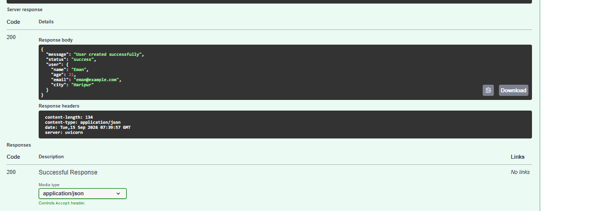
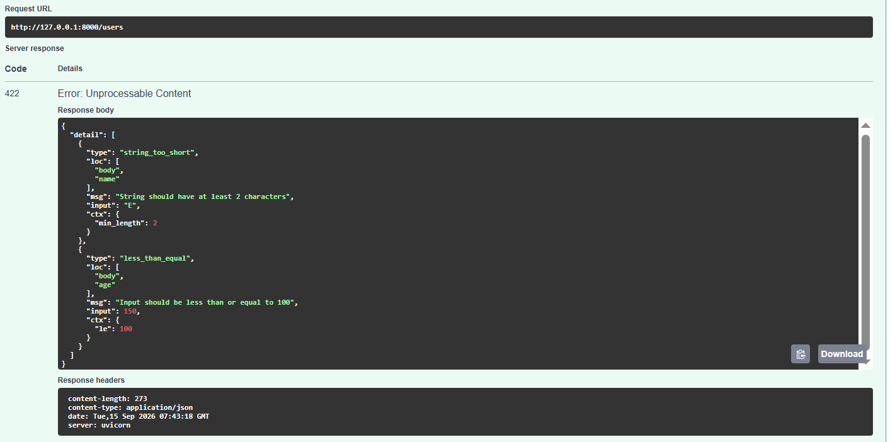

# Day 33 – Request & Response Validation with Pydantic

## Objective

The objective of Day 33 is to implement request and response validation in a FastAPI application using Pydantic models. The API validates incoming data, enforces data types and field rules, rejects invalid requests automatically, and returns structured JSON responses.

## Technologies Used

* Python
* FastAPI
* Pydantic
* Uvicorn
* Swagger UI

## Project Structure

```text
Day-33-Pydantic-Validation/
│
├── screenshots/
│   ├── Day-33-Valid-Request.png
│   └── Day-33-Invalid-Request.png
│
├── src/
│   └── main.py
│
├── .gitignore
├── requirements.txt
└── README.md
```

## Pydantic Request Model

The `UserRequest` Pydantic model validates the incoming user data.

Validation rules include:

* `name` must contain 2 to 50 characters.
* `age` must be between 1 and 100.
* `email` must be provided as a string.
* `city` must contain 2 to 50 characters.

## Pydantic Response Model

The `UserResponse` model defines a consistent structure for successful API responses.

The response contains:

* `message`
* `status`
* `user`

## API Endpoint

### POST `/users`

This endpoint accepts user information and validates it using the `UserRequest` Pydantic model.

### Valid Request

```json
{
  "name": "Eman",
  "age": 21,
  "email": "eman@example.com",
  "city": "Haripur"
}
```

### Successful Response

The API returns HTTP `200` with a structured JSON response.



## Invalid Request Validation

The API automatically rejects invalid data through FastAPI's validation system.

Example invalid request:

```json
{
  "name": "E",
  "age": 150,
  "email": "eman@example.com",
  "city": "Haripur"
}
```

The request is rejected with HTTP `422 Unprocessable Content`.

Validation errors include:

* `name` is shorter than the required minimum length.
* `age` is greater than the maximum allowed value of 100.



## Automatic Validation

FastAPI automatically validates incoming request data against the Pydantic model before the endpoint processes the request.

Invalid requests are rejected automatically with appropriate validation error details.

## API Documentation

Swagger UI is available at:

```text
http://127.0.0.1:8000/docs
```

## Key Learning Outcomes

* Created Pydantic request models.
* Created Pydantic response models.
* Implemented automatic input validation.
* Applied field-level validation rules.
* Tested valid API requests.
* Tested and rejected invalid API requests.
* Returned consistent and structured JSON responses.
* Used FastAPI's built-in validation system.

## Conclusion

Day 33 successfully enhanced the FastAPI application with Pydantic request and response validation. The API now validates user input automatically, rejects invalid data with clear error messages, and provides structured responses for successful requests.
