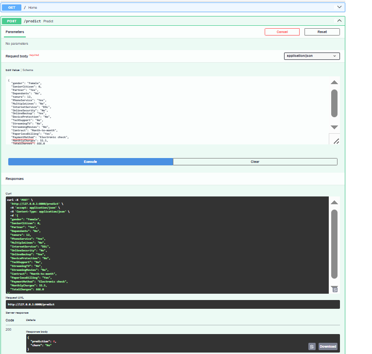

# Day 34 - Building a Machine Learning Prediction Endpoint

## Objective

The objective of Day 34 was to integrate a trained Machine Learning model into a FastAPI application and expose it through a prediction endpoint.

The project accepts customer information through a POST `/predict` endpoint, validates the incoming data using Pydantic, loads the trained Machine Learning model from Day 30, generates a prediction, and returns the result as a structured JSON response.

---

## Task

Build a Machine Learning prediction endpoint using FastAPI and Pydantic that:

* Accepts input data through a POST `/predict` endpoint.
* Validates incoming request data using Pydantic.
* Loads the trained Machine Learning model from Day 30.
* Processes the input data.
* Generates a customer churn prediction.
* Returns the prediction as a JSON response.

---

## Technologies Used

* Python
* FastAPI
* Pydantic
* Pandas
* Joblib
* Scikit-learn
* Uvicorn

---

## Project Structure

```text
Day-34-ML-Prediction-Endpoint/
│
├── models/
│   └── churn_model_v1.joblib
│
├── screenshots/
│   └── Day-34-Predict-Output.png
│
├── src/
│   └── main.py
│
├── README.md
└── requirements.txt
```

---

## Machine Learning Model

The trained Machine Learning model developed during **Day 30 - Production-Ready ML Pipeline** was reused in this project.

The saved model is:

```text
models/churn_model_v1.joblib
```

The model is loaded using Joblib when the FastAPI application starts.

---

## API Endpoint

### POST `/predict`

The `/predict` endpoint accepts customer information as JSON input and generates a customer churn prediction.

### Request Validation

Pydantic is used to define the request model and validate incoming data.

The API validates:

* Required fields
* Integer values
* Numeric values
* Minimum values
* Maximum values for applicable fields

Invalid or incomplete requests are automatically rejected by FastAPI with validation errors.

---

## Example Request

```json
{
  "gender": "Female",
  "SeniorCitizen": 0,
  "Partner": "Yes",
  "Dependents": "No",
  "tenure": 12,
  "PhoneService": "Yes",
  "MultipleLines": "No",
  "InternetService": "DSL",
  "OnlineSecurity": "No",
  "OnlineBackup": "Yes",
  "DeviceProtection": "No",
  "TechSupport": "No",
  "StreamingTV": "No",
  "StreamingMovies": "No",
  "Contract": "Month-to-month",
  "PaperlessBilling": "Yes",
  "PaymentMethod": "Electronic check",
  "MonthlyCharges": 55.5,
  "TotalCharges": 666.0
}
```

---

## Example Response

```json
{
  "prediction": 0,
  "churn": "No"
}
```

Where:

* `prediction: 0` means the model predicts **No Churn**.
* `prediction: 1` means the model predicts **Churn**.

---

## API Documentation

FastAPI automatically provides interactive API documentation.

After starting the application, open:

```text
http://127.0.0.1:8000/docs
```

The Swagger UI provides an interface to test the `/predict` endpoint.

---

## Running the Application

Activate the project virtual environment:

```powershell
& "C:\Users\ztech.pk\Documents\AI ML Internship\.venv\Scripts\Activate.ps1"
```

Install the required dependencies:

```powershell
pip install -r requirements.txt
```

Start the FastAPI application:

```powershell
uvicorn src.main:app --reload
```

The application runs at:

```text
http://127.0.0.1:8000
```

Swagger documentation is available at:

```text
http://127.0.0.1:8000/docs
```

---

## Testing the Prediction Endpoint

The `/predict` endpoint was successfully tested through the FastAPI Swagger interface.

The request data was submitted through the Swagger UI and the trained Machine Learning model generated a prediction.

The API returned the prediction in structured JSON format.

---

## Request Validation Testing

An invalid request containing only the `gender` field was also tested.

FastAPI returned validation errors for the missing required fields, confirming that Pydantic request validation is working correctly.

Example validation response:

```text
422 Unprocessable Entity
```

The validation response identified missing fields such as:

```text
SeniorCitizen
Partner
Dependents
tenure
PhoneService
MultipleLines
InternetService
OnlineSecurity
OnlineBackup
DeviceProtection
TechSupport
StreamingTV
StreamingMovies
Contract
PaperlessBilling
PaymentMethod
MonthlyCharges
TotalCharges
```

This confirms that incomplete requests are rejected before prediction processing.

---

## Screenshot

The successful `/predict` endpoint test was captured through the FastAPI Swagger UI.



---

## Functional Requirements Completed

| Requirement                               | Status    |
| ----------------------------------------- | --------- |
| Create POST `/predict` endpoint           | Completed |
| Accept input using Pydantic request model | Completed |
| Validate incoming requests                | Completed |
| Load Day 30 trained model                 | Completed |
| Generate predictions                      | Completed |
| Return JSON response                      | Completed |
| Test API using Swagger UI                 | Completed |
| Add API screenshot                        | Completed |

---

## Key Learning Outcomes

* Learned how to integrate a trained Machine Learning model with FastAPI.
* Learned how to create a POST prediction endpoint.
* Learned how to use Pydantic for request validation.
* Learned how to load a saved model using Joblib.
* Learned how to process API input using Pandas.
* Learned how to generate predictions through an API.
* Learned how FastAPI returns structured JSON responses.
* Learned how to test APIs using Swagger UI.
* Learned how automatic validation errors are generated for invalid requests.

---

## Conclusion

Day 34 successfully transformed the trained Machine Learning model from Day 30 into a usable FastAPI prediction service.

The `/predict` endpoint accepts customer data, validates the request using Pydantic, loads the saved Machine Learning model, generates a customer churn prediction, and returns the result as a structured JSON response.

This project demonstrates how a Machine Learning model can be integrated into a real-world API service.
