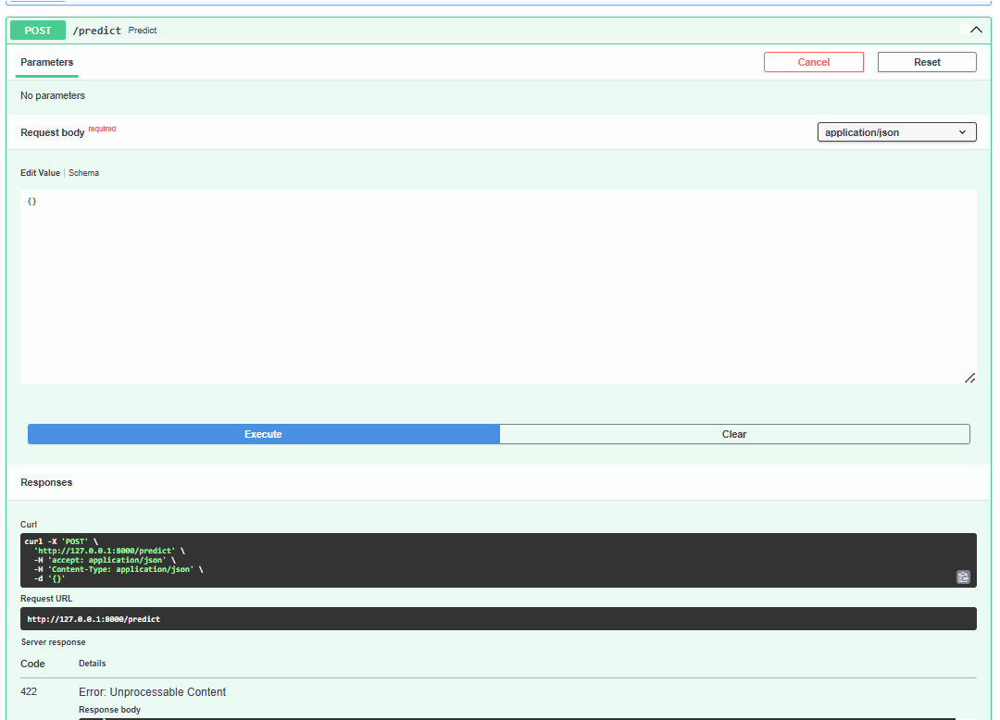
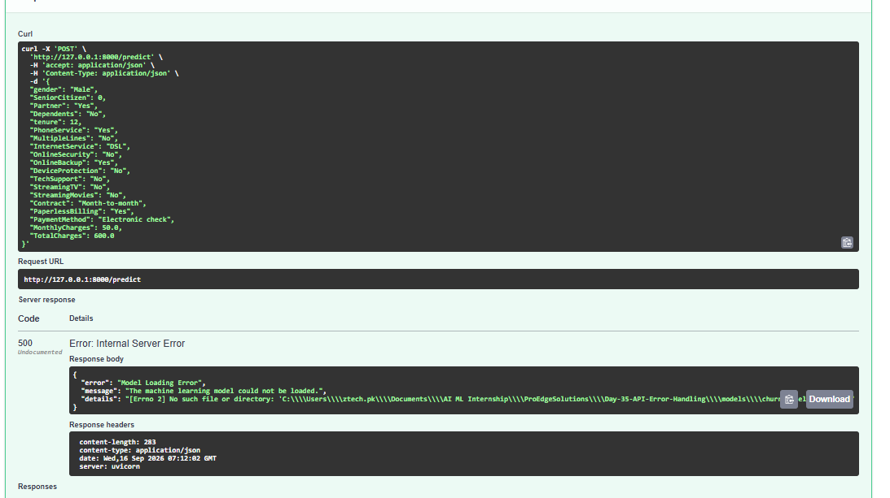
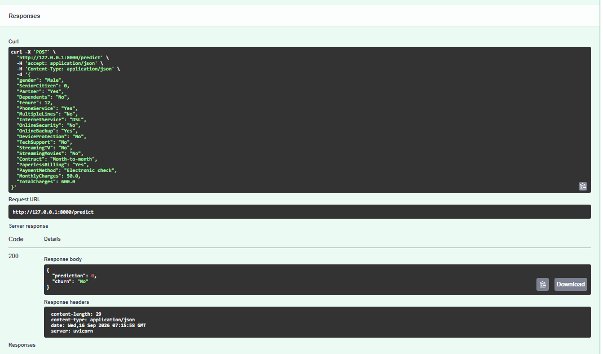

# Day 35 - API Error Handling & Pull Request Workflow

## Objective

The objective of Day 35 is to improve the reliability of the FastAPI Machine Learning application by implementing error handling, validation, meaningful error messages, and appropriate HTTP status codes.

The task also demonstrates a professional GitHub workflow using a feature branch and Pull Request.

## Project Overview

This project extends the Customer Churn Prediction API developed in Day 34.

The API accepts customer information and uses a trained Machine Learning model to predict whether a customer is likely to churn.

## Error Handling Implemented

The API handles the following situations:

1. Invalid request data
2. Missing or incomplete input values
3. Machine Learning model loading failures
4. Prediction errors
5. Meaningful structured error messages
6. Appropriate HTTP status codes

## HTTP Status Codes

| Status Code | Purpose                            |
| ----------- | ---------------------------------- |
| 200         | Successful prediction              |
| 422         | Invalid or incomplete request data |
| 500         | Model loading or prediction error  |

## Validation Error

When required fields are missing or input values are invalid, the API returns a structured validation error with HTTP status code `422`.

Example:

```json
{
  "error": "Validation Error",
  "message": "Invalid or incomplete request data."
}
```

### Validation Error Screenshot



## Model Loading Error

If the trained Machine Learning model cannot be loaded, the API returns HTTP status code `500` with a meaningful error message.

Example:

```json
{
  "error": "Model Loading Error",
  "message": "The machine learning model could not be loaded."
}
```

### Model Error Screenshot



## Successful Prediction

When valid customer data is provided and the model is available, the API returns a successful prediction.

Example:

```json
{
  "prediction": 0,
  "churn": "No"
}
```

### Successful Prediction Screenshot



## Technologies Used

* Python
* FastAPI
* Pydantic
* Pandas
* Joblib
* Uvicorn
* Machine Learning
* Git
* GitHub

## GitHub Pull Request Workflow

The Day 35 work follows a feature branch workflow.

### Feature Branch

```text
day-35-error-handling
```

### Workflow

1. Created a feature branch from `main`.
2. Implemented API error handling.
3. Tested validation and model errors.
4. Tested successful API prediction.
5. Committed the changes.
6. Pushed the feature branch to GitHub.
7. Created a Pull Request.
8. Reviewed the changes.
9. Merged the Pull Request into `main`.

## Conclusion

Day 35 improved the Customer Churn Prediction API by adding structured error handling, request validation, model failure handling, meaningful error messages, and appropriate HTTP status codes.

The task also demonstrated a professional GitHub Pull Request workflow using a feature branch before merging changes into the main branch.
