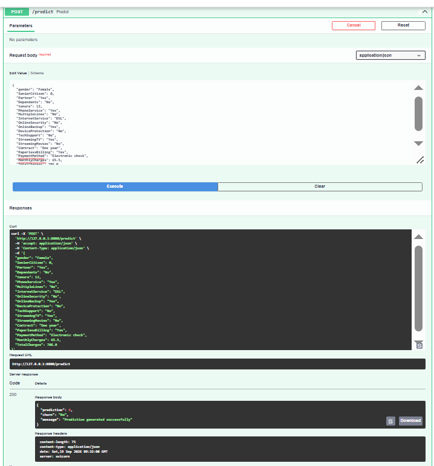
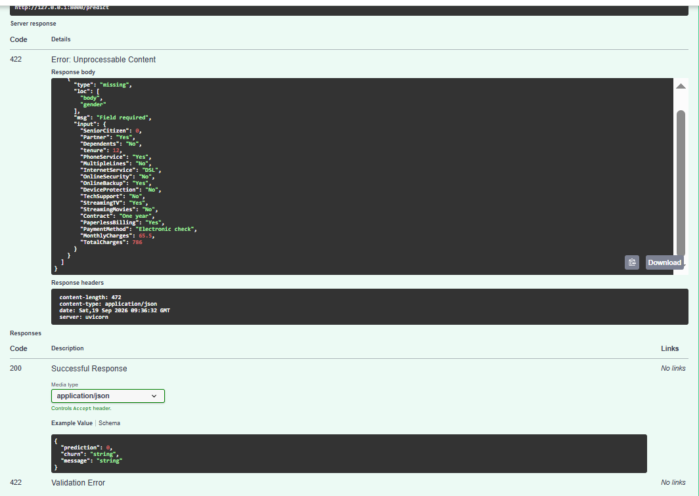

# Day 36 - ML Prediction API

## Overview

This project implements a Machine Learning Prediction API using **FastAPI** and the trained Customer Churn Prediction model from Day 30.

The API provides:

* Health check endpoint
* Customer churn prediction endpoint
* Pydantic request validation
* Structured JSON responses
* Error handling
* ML model loading with Joblib
* Request and prediction logging
* Swagger API documentation
* Automated API tests

---

## Project Structure

```text
Day-36-ML-Prediction-API/
│
├── models/
│   └── churn_model_v1.joblib
│
├── logs/
│   └── api.log
│
├── screenshots/
│   ├── Day-36-Successful-Prediction.png
│   └── Day-36-Validation-Error.png
│
├── src/
│   ├── __init__.py
│   ├── config.py
│   ├── logging_config.py
│   ├── main.py
│   └── models.py
│
├── tests/
│   └── test_api.py
│
├── data/
│
├── .gitignore
├── README.md
└── requirements.txt
```

---

## Technologies Used

* Python
* FastAPI
* Pydantic
* Uvicorn
* Joblib
* Scikit-learn
* Pandas
* NumPy
* Pytest
* HTTPX2
* Python Logging

---

## API Endpoints

### 1. Root Endpoint

**GET /**

Returns basic information about the API.

Example response:

```json
{
  "message": "Customer Churn Prediction API",
  "version": "1.0.0",
  "docs": "/docs"
}
```

---

### 2. Health Check

**GET /health**

Checks whether the ML model is loaded successfully.

Example response:

```json
{
  "status": "healthy",
  "model_loaded": true
}
```

---

### 3. Prediction

**POST /predict**

Accepts customer information and returns a churn prediction.

Example response:

```json
{
  "prediction": 0,
  "churn": "No",
  "message": "Prediction generated successfully"
}
```

Where:

* `0` = No Churn
* `1` = Churn

---

## Request Validation

The API uses Pydantic models to validate incoming customer data.

Validation includes:

* Required fields
* Integer ranges
* Numeric values
* Monthly charges
* Total charges
* Customer tenure

If required data is missing or invalid, the API returns:

```text
422 Validation Error
```

---

## Error Handling

The API handles:

* Missing ML model
* Invalid request data
* Prediction errors
* Unexpected runtime errors

Model loading or prediction failures return appropriate HTTP error responses.

---

## Machine Learning Model

The API uses the trained model:

```text
models/churn_model_v1.joblib
```

The model was created during **Day 30 - Production-Ready ML Pipeline**.

The model is loaded using Joblib when the FastAPI application starts.

---

## Logging

Structured application logging is implemented using Python's `logging` module.

Logs are stored in:

```text
logs/api.log
```

The API logs:

* API requests
* Health checks
* Model loading
* Input preparation
* Successful predictions
* Validation/prediction errors
* Model loading errors

---

## Swagger Documentation

FastAPI automatically provides interactive API documentation.

Open:

```text
http://127.0.0.1:8000/docs
```

Swagger can be used to test:

* Root endpoint
* Health endpoint
* Prediction endpoint
* Request validation

---

## Running the Application

### Step 1: Activate Virtual Environment

```powershell
& "C:\Users\ztech.pk\Documents\AI ML Internship\.venv\Scripts\Activate.ps1"
```

### Step 2: Install Dependencies

```powershell
pip install -r requirements.txt
```

### Step 3: Start FastAPI Server

```powershell
python -m uvicorn src.main:app --reload
```

The API will run at:

```text
http://127.0.0.1:8000
```

Swagger documentation:

```text
http://127.0.0.1:8000/docs
```

---

## Testing

Automated tests are implemented using Pytest.

Run:

```powershell
$env:PYTHONPATH="."
pytest
```

Test results:

```text
4 passed
```

The tests cover:

1. Root endpoint
2. Health check
3. Prediction endpoint
4. Validation error

---

## Screenshots

### Successful Prediction



### Validation Error



---

## Day 36 Objectives Completed

* [x] FastAPI ML Prediction API
* [x] Health check endpoint
* [x] POST prediction endpoint
* [x] Day 30 trained model integrated
* [x] Pydantic request validation
* [x] Structured JSON response
* [x] Error handling
* [x] Logging
* [x] Swagger documentation
* [x] Automated tests
* [x] Git feature branch workflow

---

## Conclusion

Day 36 implements a complete Machine Learning Prediction API using FastAPI. The API integrates the production-trained customer churn model, validates requests, handles errors, records logs, provides Swagger documentation, and includes automated tests.
