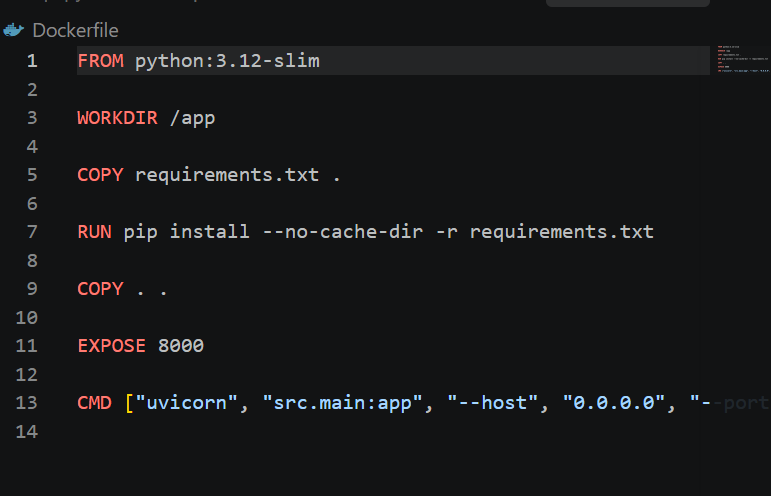
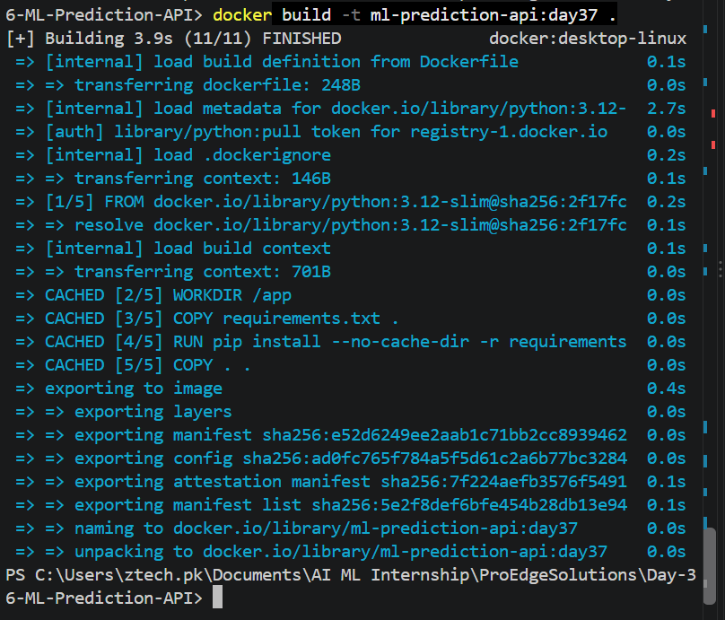
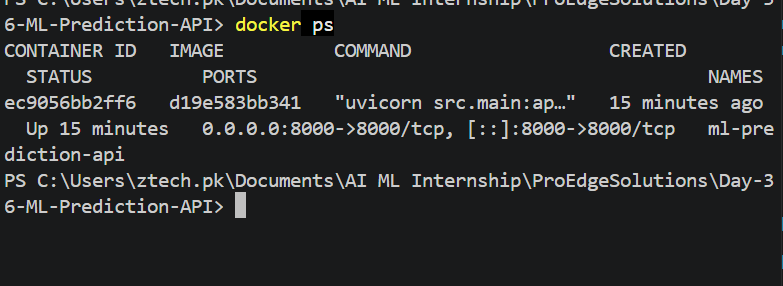
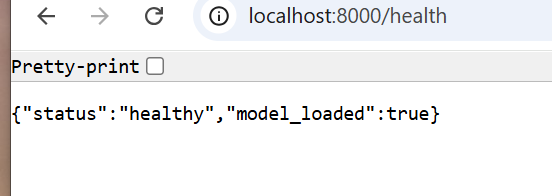
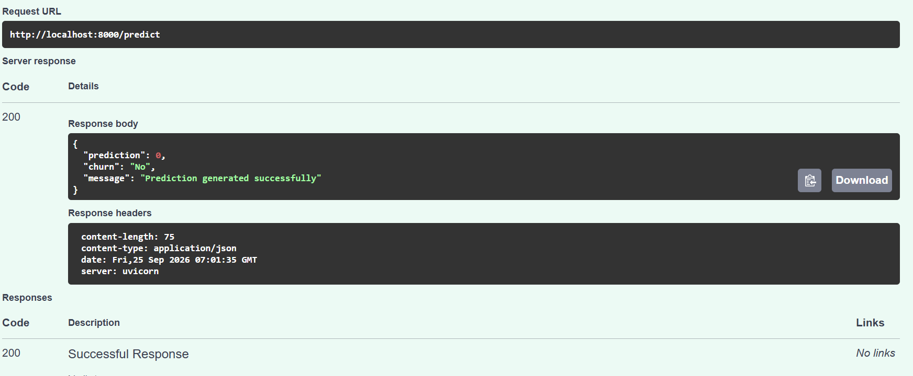

# Day 37 – Docker Containerization

## Objective

Containerize the Customer Churn Prediction API developed in Day 36 using Docker and verify that the API works successfully inside a Docker container.

## Technologies Used

* Python 3.12
* FastAPI
* Uvicorn
* Docker
* Docker Desktop
* Scikit-learn
* Joblib

## Project Structure

```text
Day-37-Docker-Containerization/
│
├── screenshots/
│   ├── Day-37-Dockerfile.png
│   ├── Day-37-Docker-Build.png
│   ├── Day-37-Docker-Container.png
│   ├── Day-37-Health-Check.png
│   └── Day-37-Predict-API.png
│
└── README.md
```

## Dockerfile

The Customer Churn Prediction API was containerized using a lightweight Python 3.12 slim image.

The Dockerfile performs the following tasks:

* Uses `python:3.12-slim` as the base image
* Sets `/app` as the working directory
* Copies `requirements.txt`
* Installs the required Python dependencies
* Copies the application files into the container
* Exposes port `8000`
* Starts the FastAPI application using Uvicorn

### Dockerfile

```dockerfile
FROM python:3.12-slim

WORKDIR /app

COPY requirements.txt .

RUN pip install --no-cache-dir -r requirements.txt

COPY . .

EXPOSE 8000

CMD ["uvicorn", "src.main:app", "--host", "0.0.0.0", "--port", "8000"]
```



## Docker Ignore

A `.dockerignore` file was created to prevent unnecessary files and folders from being copied into the Docker image.

The following items were excluded:

```text
.venv/
__pycache__/
*.pyc
.pytest_cache/
.git/
.gitignore
.env
tests/
screenshots/
data/
logs/
README.md
```

## Build Docker Image

The Docker image was built using the following command:

```bash
docker build -t ml-prediction-api:day37 .
```

The image was successfully built and tagged as:

```text
ml-prediction-api:day37
```



## Run Docker Container

The Docker container was started using:

```bash
docker run -d --name ml-prediction-api -p 8000:8000 ml-prediction-api:day37
```

The API was exposed through port `8000`.

The running container was verified using:

```bash
docker ps
```

The container showed the following port mapping:

```text
0.0.0.0:8000->8000/tcp
```



## API Verification

### Health Check

The health endpoint was tested through:

```text
http://localhost:8000/health
```

Successful response:

```json
{
  "status": "healthy",
  "model_loaded": true
}
```

This confirms that the FastAPI application is running inside the Docker container and the ML model has been loaded successfully.



## Swagger API Documentation

The interactive Swagger API documentation was accessed through:

```text
http://localhost:8000/docs
```

The available API endpoints were verified through Swagger UI:

* `GET /`
* `GET /health`
* `POST /predict`

## Prediction Endpoint

The `/predict` endpoint was tested successfully using Swagger UI.

Request URL:

```text
http://localhost:8000/predict
```

Successful response:

```json
{
  "prediction": 0,
  "churn": "No",
  "message": "Prediction generated successfully"
}
```

The endpoint returned:

```text
200 OK
```



## Docker Logs

The Docker container logs were checked using:

```bash
docker logs ml-prediction-api
```

The logs confirmed:

* ML model loaded successfully
* Uvicorn server started successfully
* Health check returned `200 OK`
* Prediction request returned `200 OK`
* Prediction was generated successfully

## Result

The Customer Churn Prediction API was successfully containerized using Docker.

The Docker image was built successfully, the container was started with port mapping, and the API was verified through the mapped localhost port.

The health check confirmed that the ML model was loaded successfully, and the prediction endpoint returned a successful `200 OK` response.

## Conclusion

Day 37 successfully completed the Docker containerization of the Customer Churn Prediction API.

The application is now running inside a Docker container and can be accessed through:

```text
http://localhost:8000
```

Swagger documentation is available at:

```text
http://localhost:8000/docs
```

The project successfully demonstrates Docker image creation, container execution, port mapping, API verification, and ML model serving inside a container.
