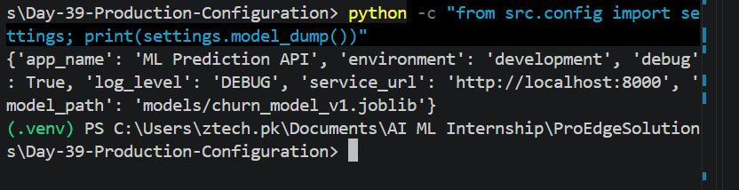
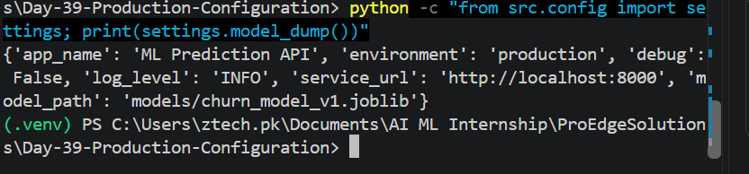
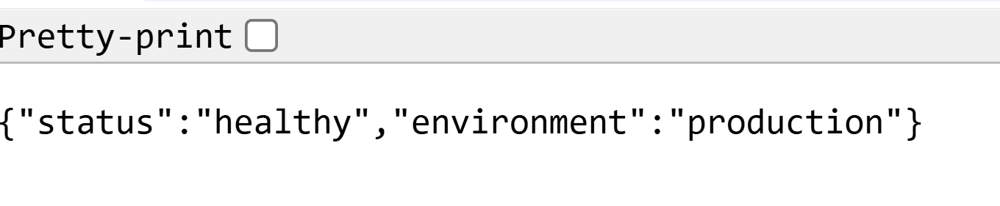

# Day 39 – Production-Ready Configuration Management

## Objective

The objective of Day 39 is to implement production-ready configuration management for an ML Prediction API using environment variables and Pydantic Settings.

## Features

* Separate development and production configuration
* Environment variable management
* `.env` file for local development
* Pydantic Settings for configuration validation
* Required configuration values
* Application startup validation
* Production environment variable override
* Secure handling of environment files
* FastAPI health check endpoint

## Project Structure

```text
Day-39-Production-Configuration/
│
├── screenshots/
│   ├── Day-39-Development-Configuration.png
│   ├── Day-39-Production-Configuration.png
│   └── Day-39-Production-Health.png
│
├── src/
│   ├── __init__.py
│   ├── config.py
│   └── main.py
│
├── .env
├── .env.example
├── .gitignore
├── requirements.txt
└── README.md
```

## Technologies Used

* Python
* FastAPI
* Pydantic
* Pydantic Settings
* Python Dotenv
* Uvicorn

## Configuration Management

The application uses `pydantic-settings` to load and validate configuration values.

The configuration is defined in:

```text
src/config.py
```

Required configuration values:

* `APP_NAME`
* `ENVIRONMENT`
* `DEBUG`
* `LOG_LEVEL`
* `SERVICE_URL`
* `MODEL_PATH`

The application loads values from environment variables and the local `.env` file.

## Development Configuration

For local development, configuration values are stored in `.env`.

Example:

```env
APP_NAME=ML Prediction API
ENVIRONMENT=development
DEBUG=true
LOG_LEVEL=DEBUG
SERVICE_URL=http://localhost:8000
MODEL_PATH=models/churn_model_v1.joblib
```

The `.env` file is excluded from Git to prevent environment-specific values or secrets from being committed.

## Production Configuration

Production values can be provided through environment variables instead of the `.env` file.

Example PowerShell configuration:

```powershell
$env:ENVIRONMENT="production"
$env:DEBUG="false"
$env:LOG_LEVEL="INFO"
```

Environment variables override the values defined in `.env`.

This allows the same application code to run in different environments without changing the source code.

## Development vs Production

| Setting              | Development | Production            |
| -------------------- | ----------- | --------------------- |
| Environment          | development | production            |
| Debug                | true        | false                 |
| Log Level            | DEBUG       | INFO                  |
| Configuration Source | `.env`      | Environment Variables |
| Service URL          | localhost   | Production URL        |

## Configuration Validation

Pydantic Settings validates all required configuration values when the application starts.

If required configuration values are missing, the application raises a validation error and does not start successfully.

Example validation error:

```text
ValidationError
Field required
```

The required fields include:

```text
app_name
environment
debug
log_level
service_url
model_path
```

## Production Environment Test

The application was tested using production environment variables.

Expected configuration:

```text
environment = production
debug = False
log_level = INFO
```

The API successfully loaded the production configuration.

## Health Check

The application provides a health check endpoint:

```text
GET /health
```

Expected response:

```json
{
  "status": "healthy",
  "environment": "production"
}
```

## Security

The following files are excluded from Git:

```text
.env
.env.*
```

The `.env.example` file is included as a safe template for required configuration values.

No secrets should be stored directly in the source code or committed to GitHub.

## Installation

Activate the project virtual environment:

```powershell
& "C:\Users\ztech.pk\Documents\AI ML Internship\.venv\Scripts\Activate.ps1"
```

Install dependencies:

```powershell
pip install -r requirements.txt
```

## Run the Application

Start the FastAPI application using:

```powershell
python -m uvicorn src.main:app --reload
```

The API will be available at:

```text
http://127.0.0.1:8000
```

Health check:

```text
http://127.0.0.1:8000/health
```

## Screenshots

### Development Configuration



### Production Configuration



### Production Health Check



## Learning Outcome

After completing Day 39, the application can:

* Manage configuration using environment variables
* Load local development settings from `.env`
* Use production environment variables
* Validate required configuration using Pydantic Settings
* Prevent application startup when required configuration is missing
* Keep environment-specific configuration outside the source code
* Follow basic security practices for configuration management
