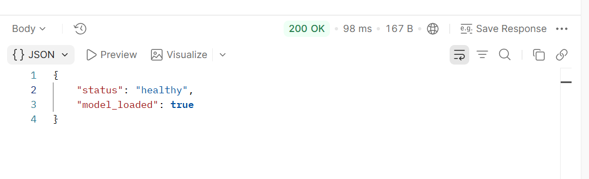
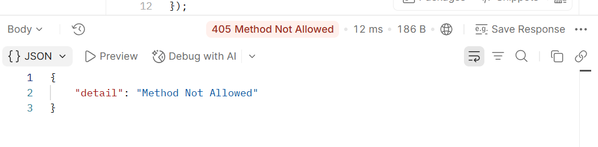
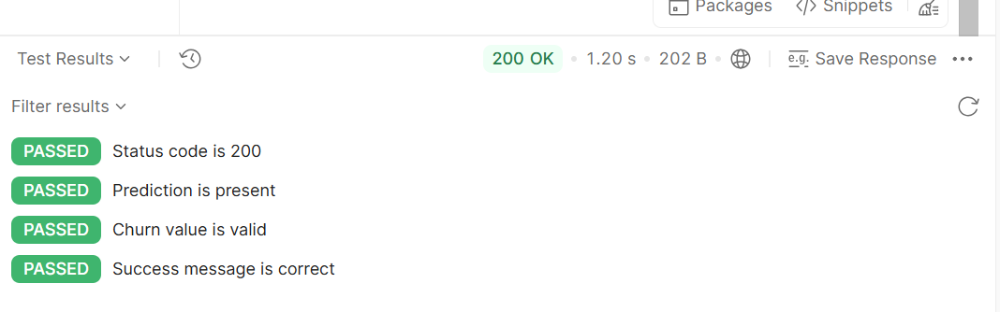
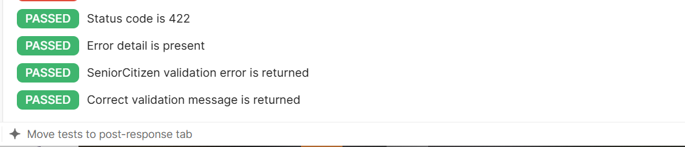
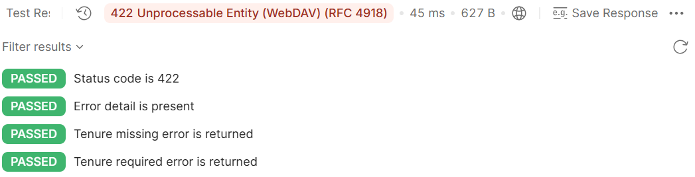

# Day 40 – API Testing with Postman

## Objective

Test the ML Prediction API using Postman and verify successful responses, validation errors, and incorrect HTTP methods.

## API Base URL

```text
http://localhost:8000
```

## Endpoints Tested

| Test                       | Method | Endpoint   | Expected Status |
| -------------------------- | ------ | ---------- | --------------- |
| Health - Success           | GET    | `/health`  | 200             |
| Health - Error             | POST   | `/health`  | 405             |
| Prediction - Success       | POST   | `/predict` | 200             |
| Prediction - Invalid Input | POST   | `/predict` | 422             |
| Prediction - Missing Field | POST   | `/predict` | 422             |

## Test Cases

### 1. Health - Success

* Method: GET
* Endpoint: `/health`
* Expected status: 200
* Verifies that the API is healthy and the ML model is loaded.

### 2. Health - Error

* Method: POST
* Endpoint: `/health`
* Expected status: 405
* Verifies handling of an unsupported HTTP method.

### 3. Prediction - Success

* Method: POST
* Endpoint: `/predict`
* Expected status: 200
* Verifies that a valid customer request returns a prediction and churn value.

### 4. Prediction - Invalid Input

* Method: POST
* Endpoint: `/predict`
* Invalid value: `SeniorCitizen = 5`
* Expected status: 422
* Verifies Pydantic validation for invalid input.

### 5. Prediction - Missing Field

* Method: POST
* Endpoint: `/predict`
* Missing field: `tenure`
* Expected status: 422
* Verifies validation when a required field is missing.

## How to Run the API

Start the Docker Compose application:

```powershell
docker compose up --build
```

The API will be available at:

```text
http://localhost:8000
```

## Postman Testing

1. Open Postman.
2. Open the `Day 40 - ML Prediction API Tests` collection.
3. Make sure the API is running.
4. Run each request individually.
5. Verify the response status and test results.
6. Check that successful requests return status `200`.
7. Check that invalid or missing input returns status `422`.
8. Check that the unsupported HTTP method returns status `405`.

## Screenshots

### Health Success



### Health Error



### Prediction Success



### Prediction Invalid Input



### Prediction Missing Field



## Conclusion

The ML Prediction API was tested successfully using Postman. Successful requests, invalid inputs, missing required fields, and unsupported HTTP methods were verified.
