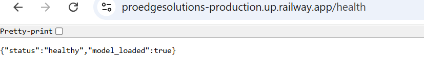
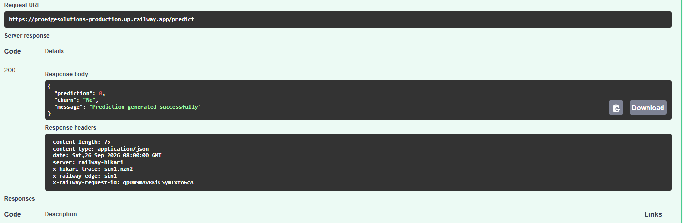

# Day 41 – Cloud Deployment of ML Prediction API

## Objective

Deploy the containerized Machine Learning Prediction API to the cloud and make it publicly accessible.

## Deployment Platform

* **Platform:** Railway
* **Application:** Customer Churn Prediction API
* **Deployment Type:** Docker
* **Status:** Successfully deployed
* **Live API URL:** https://proedgesolutions-production.up.railway.app

## API Endpoints

| Method | Endpoint   | Purpose                            |
| ------ | ---------- | ---------------------------------- |
| GET    | `/`        | API information                    |
| GET    | `/health`  | Check API and ML model health      |
| POST   | `/predict` | Generate customer churn prediction |

## Live API Verification

### Health Check

The live health endpoint returned:

```json
{
  "status": "healthy",
  "model_loaded": true
}
```

### Prediction Test

The live `/predict` endpoint was tested successfully and returned HTTP `200 OK`.

Response:

```json
{
  "prediction": 0,
  "churn": "No",
  "message": "Prediction generated successfully"
}
```

## Docker Deployment

The API was deployed using the existing Dockerized application.

The Docker container:

* Uses Python 3.12
* Installs the required Python dependencies
* Copies the application source code and ML model
* Runs the FastAPI application with Uvicorn
* Uses the platform-provided `PORT` environment variable

## Environment Configuration

Environment variables are configured through the Railway dashboard instead of committing sensitive configuration files to GitHub.

No sensitive credentials or secret values are stored in the repository.

## Deployment Verification

The following checks were completed successfully:

* Railway deployment is online
* Public API URL is accessible
* `/health` endpoint returns healthy status
* ML model loads successfully
* `/predict` endpoint returns HTTP 200
* Live prediction is generated successfully

## Screenshots

### Swagger API Documentation


### Health Check



### Successful Prediction



## Changes Made

* Prepared the ML Prediction API for cloud deployment
* Added root-level Docker deployment configuration
* Configured the application to use Railway's dynamic `PORT`
* Deployed the API to Railway
* Verified the public health endpoint
* Verified the live prediction endpoint
* Added deployment screenshots and documentation

## Conclusion

The Customer Churn Prediction API was successfully deployed to Railway and verified through its public API URL. The live API is able to load the trained ML model and generate customer churn predictions.
