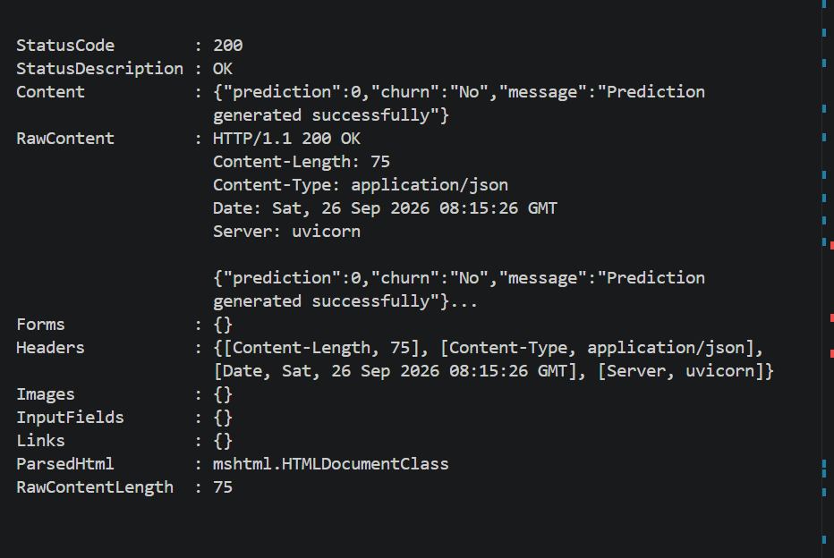
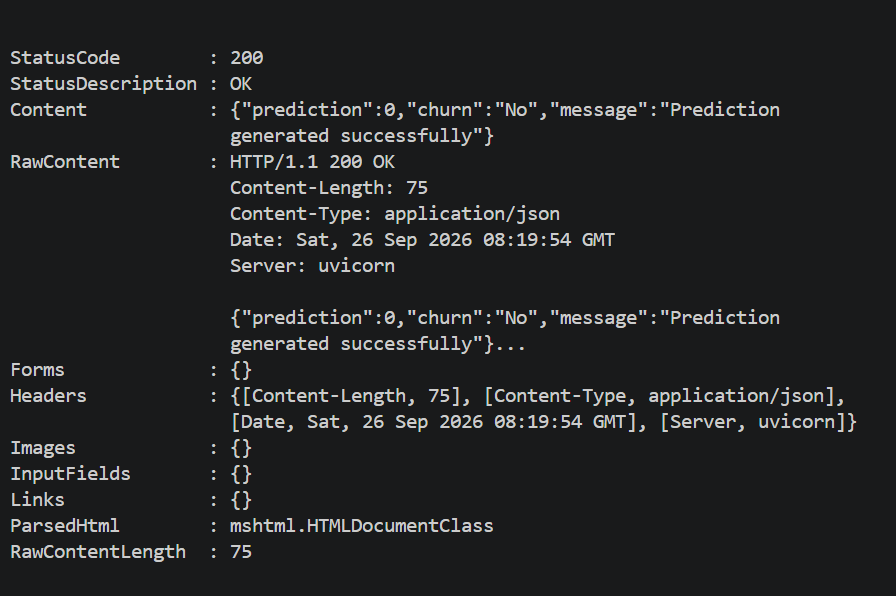

# Day 42 – Fully Deployable Machine Learning Application

## Objective

Finalize and deploy a complete production-style Machine Learning application by integrating the trained ML pipeline, FastAPI API, Docker Compose, environment-based configuration, API testing, and cloud deployment.

The application provides a **Customer Churn Prediction API** that runs locally through Docker Compose and is also deployed to Railway for public access.

---

## Project Overview

This project integrates the Machine Learning and API development work completed throughout Week 7 into a single deployable application.

The application accepts customer information through a FastAPI endpoint and uses a trained Machine Learning pipeline to predict whether a customer is likely to churn.

### Main Components

* Trained Machine Learning pipeline
* FastAPI REST API
* Pydantic request validation
* Docker containerization
* Docker Compose
* Redis service
* Environment-based configuration
* Structured logging
* Automated API testing
* Postman API testing
* Railway cloud deployment
* Swagger API documentation

---

## Functional Requirements

### 1. ML Pipeline Integration

The trained Customer Churn Machine Learning pipeline is integrated with the FastAPI application.

The `/predict` endpoint receives customer information, processes the input through the trained model, and returns a churn prediction.

### Example Successful Response

```json
{
  "prediction": 0,
  "churn": "No",
  "message": "Prediction generated successfully"
}
```

---

## 2. Docker Compose

The application can be started locally using Docker Compose.

The Docker Compose environment contains:

* FastAPI ML Prediction API
* Redis service

### Start the Application

```bash
docker compose up -d
```

### Build and Start

```bash
docker compose up --build
```

### Check Running Containers

```bash
docker compose ps
```

### Stop the Application

```bash
docker compose down
```

### View Logs

```bash
docker compose logs
```

---

## Local Application

After starting Docker Compose, the API is available at:

```text
http://localhost:8000
```

Redis is available on:

```text
localhost:6379
```

---

## Local Docker Verification

The application was successfully tested using Docker Compose.

### Running Services

```text
ml_prediction_api     Up
ml_prediction_redis   Up
```

The API container successfully exposed port `8000`, while the Redis container exposed port `6379`.

---

## Health Check

### Endpoint

```text
GET /health
```

### Local URL

```text
http://localhost:8000/health
```

### Successful Response

```json
{
  "status": "healthy",
  "model_loaded": true
}
```

The health check returned HTTP `200 OK`, confirming that the API was running and the trained ML model was successfully loaded.

### Screenshot



---

## Prediction Endpoint

### Endpoint

```text
POST /predict
```

### Local URL

```text
http://localhost:8000/predict
```

### Successful Response

```json
{
  "prediction": 0,
  "churn": "No",
  "message": "Prediction generated successfully"
}
```

The prediction endpoint returned HTTP `200 OK` and successfully generated a customer churn prediction.

### Screenshot



---

## API Endpoints

| Method | Endpoint    | Description                        |
| ------ | ----------- | ---------------------------------- |
| GET    | `/`         | API root                           |
| GET    | `/health`   | Health check and model status      |
| GET    | `/api/info` | API information                    |
| POST   | `/predict`  | Generate customer churn prediction |

---

## Request Validation

The API uses **Pydantic** models to validate incoming customer data.

Validation covers:

* Required fields
* Numeric values
* Allowed categorical values
* Customer tenure
* Senior citizen value
* Monthly charges
* Total charges
* Customer service information

Invalid requests are rejected with an appropriate HTTP `422 Unprocessable Entity` response.

---

## Configuration Management

The application uses environment-based configuration to separate application settings from source code.

Configuration includes:

* Environment
* Dataset path
* Model path
* Model version
* Model name
* Test size
* Random state
* Number of estimators
* Logging level

This approach allows the application to use different configuration values for different environments without modifying the application source code.

Sensitive `.env` files are excluded from version control.

---

## Machine Learning Model

The application uses the trained **Customer Churn Prediction** Machine Learning pipeline developed during the previous tasks.

The model is loaded by the FastAPI application and used by the `/predict` endpoint to generate predictions.

The health endpoint also verifies whether the model has been loaded successfully.

---

## Postman Testing

The API endpoints were tested using **Postman** during Day 40.

The following scenarios were tested:

### Health Endpoint

* Health check success
* Health check error handling

### Prediction Endpoint

* Successful prediction
* Invalid input validation
* Missing required field validation

The Postman tests were completed successfully.

### Postman Screenshots

The testing evidence is available in:

```text
Day-40-API-Testing-Postman/screenshots/
```

Available screenshots include:

* `Health-Success.png`
* `Health-Error.png`
* `Prediction-Success.png`
* `Prediction-Invalid-Input.png`
* `Prediction-Missing-Field.png`

---

## Automated Testing

Automated API tests were implemented using **Pytest**.

Testing covered:

* API health check
* Prediction endpoint
* Request validation
* Successful responses
* Invalid requests

The API was also manually verified using Postman.

---

# Cloud Deployment

The Machine Learning Prediction API was deployed to **Railway** as a public cloud application.

The live deployment was verified using the public API URL.

## Live API

**Railway Deployment URL:**

```text
https://proedgesolutions-production-c66c.up.railway.app
```

### Live Health Endpoint

```text
https://proedgesolutions-production-c66c.up.railway.app/health
```

### Live Prediction Endpoint

```text
https://proedgesolutions-production-c66c.up.railway.app/predict
```

### Live Swagger Documentation

```text
https://proedgesolutions-production-c66c.up.railway.app/docs
```

The live application provides public access to the FastAPI API and interactive Swagger documentation.

---

## Cloud Deployment Verification

The cloud deployment was verified through:

* Live health endpoint
* Live prediction endpoint
* Swagger API documentation
* ML model loading
* Successful API responses

The Railway deployment successfully serves the Customer Churn Prediction API.

Cloud deployment screenshots are available in:

```text
Day-41-Cloud-Deployment/screenshots/
```

Available screenshots include:

* `Day-41-Health-Check.png`
* `Day-41-Predict-Success.png`
* `Day-41-Swagger-Docs.png`

---

## Swagger Documentation

FastAPI automatically provides interactive API documentation.

### Local Swagger

```text
http://localhost:8000/docs
```

### Live Swagger

```text
https://proedgesolutions-production-c66c.up.railway.app/docs
```

Swagger can be used to:

* View API endpoints
* Inspect request models
* Test API requests
* View API responses
* Verify API documentation

---

## Project Structure

```text
ProEdgeSolutions/
│
├── Day-36-ML-Prediction-API/
│
├── Day-38-Docker-Compose/
│   ├── data/
│   ├── models/
│   ├── screenshots/
│   ├── src/
│   ├── .dockerignore
│   ├── Dockerfile
│   ├── docker-compose.yml
│   ├── requirements.txt
│   └── README.md
│
├── Day-40-API-Testing-Postman/
│   ├── screenshots/
│   └── README.md
│
├── Day-41-Cloud-Deployment/
│   ├── screenshots/
│   └── README.md
│
└── Day-42-Fully-Deployable-ML-Application/
    ├── screenshots/
    │   ├── Day-42-Docker-Health-Check.png
    │   └── Day-42-Docker-Prediction-Success.png
    │
    └── README.md
```

---

## Technologies Used

* **Python**
* **FastAPI**
* **Pydantic**
* **Scikit-learn**
* **Pandas**
* **NumPy**
* **Joblib**
* **Docker**
* **Docker Compose**
* **Redis**
* **Postman**
* **Uvicorn**
* **Pytest**
* **Railway**

---

## How to Run Locally

### Step 1 – Clone the Repository

```bash
git clone https://github.com/emansheikhsheikh2-EMAN/ProEdgeSolutions.git
```

### Step 2 – Navigate to Docker Compose Application

```bash
cd ProEdgeSolutions/Day-38-Docker-Compose
```

### Step 3 – Build and Start Containers

```bash
docker compose up --build
```

Or run in detached mode:

```bash
docker compose up -d
```

### Step 4 – Check Containers

```bash
docker compose ps
```

### Step 5 – Open API

```text
http://localhost:8000
```

### Step 6 – Open Swagger

```text
http://localhost:8000/docs
```

### Step 7 – Test Health Endpoint

```text
http://localhost:8000/health
```

---

## Example Prediction Request

Example JSON request for the `/predict` endpoint:

```json
{
  "gender": "Male",
  "SeniorCitizen": 0,
  "Partner": "Yes",
  "Dependents": "No",
  "tenure": 12,
  "PhoneService": "Yes",
  "MultipleLines": "No",
  "InternetService": "DSL",
  "OnlineSecurity": "No",
  "OnlineBackup": "Yes",
  "DeviceProtection": "No",
  "TechSupport": "No",
  "StreamingTV": "No",
  "StreamingMovies": "No",
  "Contract": "Month-to-month",
  "PaperlessBilling": "Yes",
  "PaymentMethod": "Electronic check",
  "MonthlyCharges": 70.35,
  "TotalCharges": 845.25
}
```

### Example Response

```json
{
  "prediction": 0,
  "churn": "No",
  "message": "Prediction generated successfully"
}
```

---

## Final Verification Checklist

| Requirement                         | Status      |
| ----------------------------------- | ----------- |
| ML pipeline integrated with FastAPI | ✅ Completed |
| Docker containerization             | ✅ Completed |
| Docker Compose setup                | ✅ Completed |
| Redis service                       | ✅ Completed |
| Environment-based configuration     | ✅ Completed |
| Configuration validation            | ✅ Completed |
| Automated testing                   | ✅ Completed |
| Postman testing                     | ✅ Completed |
| Local health check                  | ✅ Passed    |
| Local prediction test               | ✅ Passed    |
| Railway cloud deployment            | ✅ Completed |
| Live API URL                        | ✅ Available |
| Swagger documentation               | ✅ Available |
| Day 42 screenshots                  | ✅ Completed |
| README documentation                | ✅ Completed |

---

## Final Result

The Customer Churn Prediction application has been finalized as a complete production-style Machine Learning API.

The application integrates:

**Machine Learning → FastAPI → Validation → Configuration → Docker → Docker Compose → Testing → Cloud Deployment**

The application can run locally using Docker Compose and is publicly accessible through its Railway deployment.

### Live Application

```text
https://proedgesolutions-production-c66c.up.railway.app
```

### Live Swagger

```text
https://proedgesolutions-production-c66c.up.railway.app/docs
```

This completes the **Day 42 – Fully Deployable Machine Learning Application** task.
