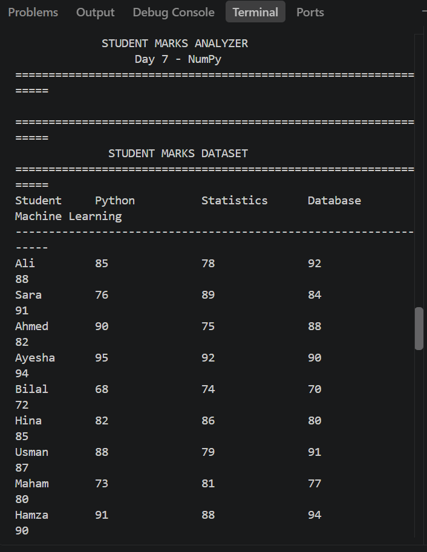
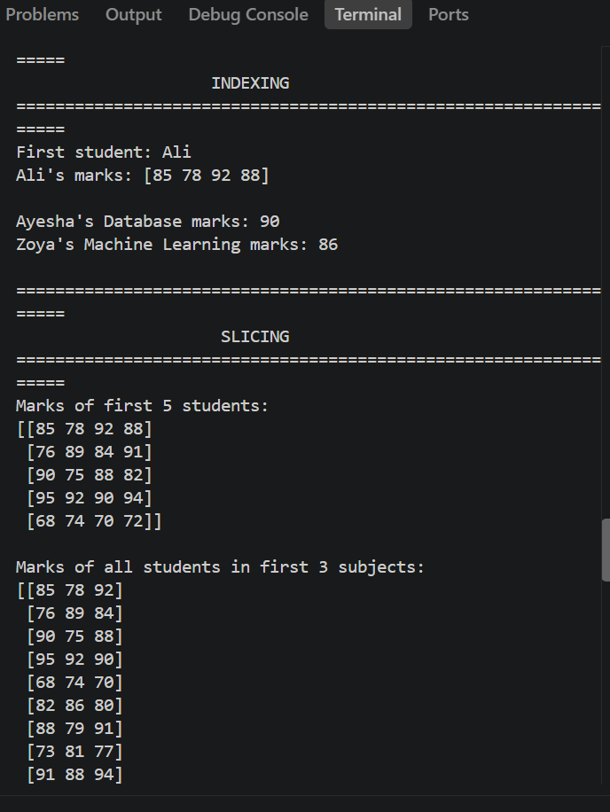
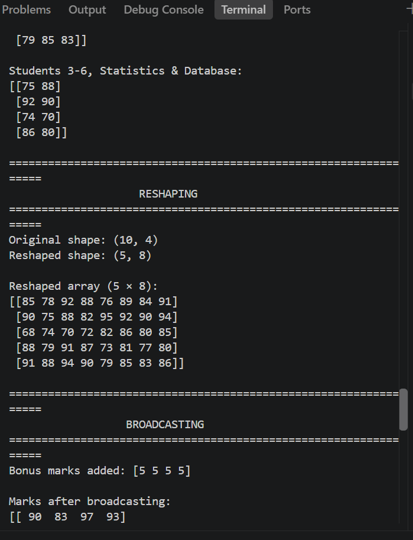

# Day 7 - Student Marks Analyzer

## Objective

The Student Marks Analyzer is a Python application developed using NumPy. It stores and analyzes marks of 10 students across multiple subjects and demonstrates important NumPy array operations used in Data Analysis and Machine Learning.

## Features

- Stores student marks using NumPy arrays
- Displays student records
- Performs array indexing
- Performs array slicing
- Reshapes NumPy arrays
- Demonstrates broadcasting
- Calculates total marks
- Calculates average marks
- Finds highest and lowest marks
- Provides subject-wise performance analysis

## NumPy Operations

### Indexing
Accesses specific students, subjects, and individual marks.

### Slicing
Selects specific rows, columns, and customized views of the dataset.

### Reshaping
Reshapes the marks array from 10 × 4 into 5 × 8.

### Broadcasting
Adds bonus marks to all subjects using NumPy broadcasting.

## Dataset

The dataset contains marks of 10 students in four subjects:

- Python
- Statistics
- Database
- Machine Learning

## Marks Analysis

The program calculates:

- Highest individual mark
- Lowest individual mark
- Total marks of each student
- Average marks of each student
- Highest-performing student
- Lowest-performing student
- Subject-wise total marks
- Subject-wise average marks

## Technologies Used

- Python
- NumPy
- VS Code

## Output Screenshots

### Dataset and Indexing

### Indexing and Slicing

### Statistics and Reshaping

### Broadcasting and Marks Analysis

### Analysis Completed

## Conclusion

This project provides practical experience with NumPy arrays and demonstrates indexing, slicing, reshaping, broadcasting, and numerical analysis of structured student marks data.