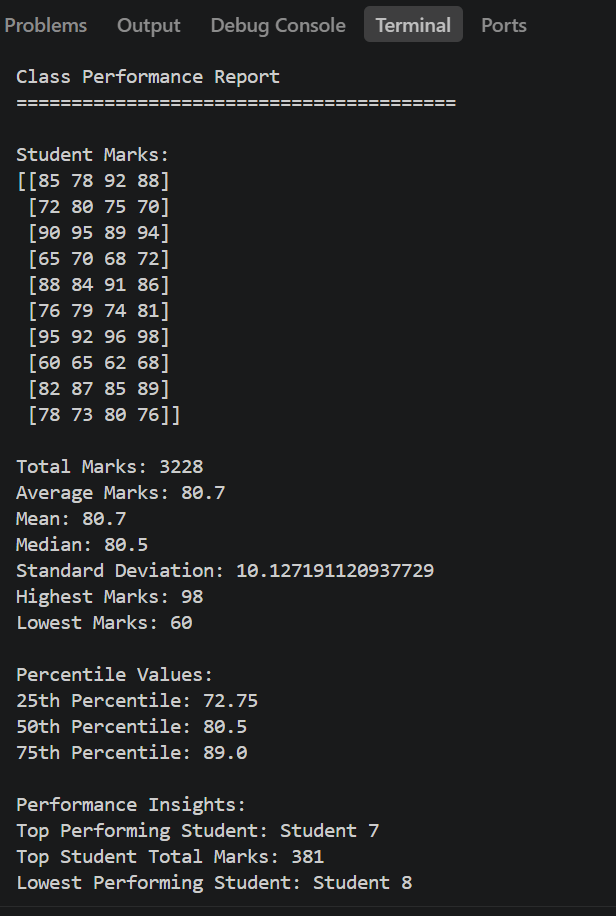
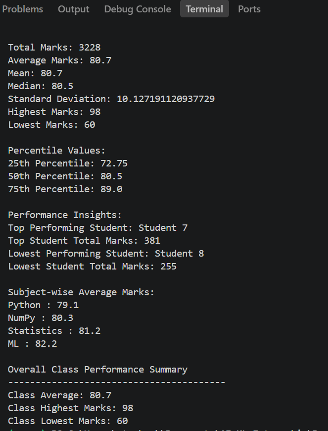

# Day 8 – NumPy Statistics & Data Analysis

## Class Performance Report System

This project is a Class Performance Report System built using Python and NumPy.

### Features

- Calculates total marks
- Calculates average and mean
- Calculates median
- Calculates standard deviation
- Finds highest and lowest marks
- Calculates percentile values
- Identifies top performing student
- Identifies lowest performing student
- Displays subject-wise average marks
- Generates overall class performance summary

### Technologies Used

- Python
- NumPy

### Dataset

The system contains marks of 10 students across 4 subjects:

- Python
- NumPy
- Statistics
- Machine Learning

### NumPy Functions Used

- `np.sum()`
- `np.mean()`
- `np.median()`
- `np.std()`
- `np.max()`
- `np.min()`
- `np.percentile()`
- `np.argmax()`
- `np.argmin()`

### Output

The program generates a structured class performance report containing statistical calculations and performance insights.

### Screenshots

#### Class Performance Report

#### Performance Summary

