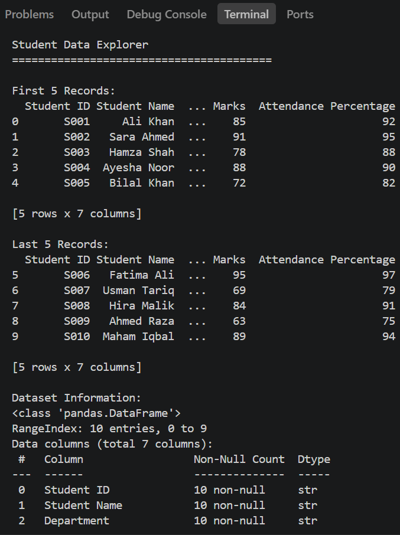
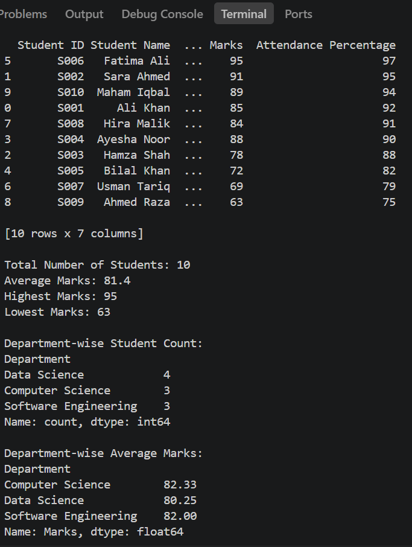

# Day 9 - Pandas Fundamentals

## Student Data Explorer

### Objective

Learn how to work with Pandas DataFrames for data loading, exploration, filtering, sorting, and analysis.

### Project Overview

The Student Data Explorer is a Python application built using Pandas. It loads student information from a CSV dataset and performs different DataFrame operations to generate useful academic insights.

### Features

- Load student data from a CSV file
- Display first 5 records
- Display last 5 records
- Display dataset information
- Display column names and data types
- Filter students by marks
- Filter students by department
- Sort students by marks
- Sort students by attendance percentage
- Calculate total number of students
- Calculate average marks
- Find highest marks
- Find lowest marks
- Display department-wise student count
- Display department-wise average marks

### Dataset

The dataset contains 10 students with the following information:

- Student ID
- Student Name
- Department
- Semester
- Age
- Marks
- Attendance Percentage

### Technologies Used

- Python
- Pandas
- CSV

### Analysis Results

- Total Students: 10
- Average Marks: 81.4
- Highest Marks: 95
- Lowest Marks: 63

### Department-wise Student Count

- Data Science: 4
- Computer Science: 3
- Software Engineering: 3

### Department-wise Average Marks

- Computer Science: 82.33
- Data Science: 80.25
- Software Engineering: 82.00

### Files

- `pandas_analysis.py` - Main Python program
- `students.csv` - Student dataset
- `README.md` - Project documentation

### Screenshots

#### Data Exploration

#### Analysis Results

### Conclusion

The Student Data Explorer demonstrates the use of Pandas DataFrames for loading, exploring, filtering, sorting, and analyzing structured student data.