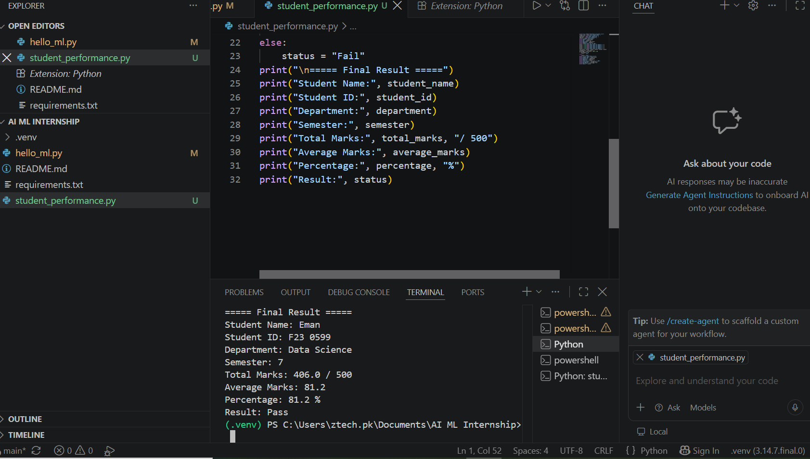

# Student Performance Calculator

## Description
A simple Python program that collects student information and marks, then calculates total marks, average marks, percentage, and pass/fail status.

## Student Information
- Student Name
- Student ID
- Department
- Semester

## Features
- Collects student information
- Takes marks for 5 subjects
- Calculates total marks
- Calculates average marks
- Calculates percentage
- Determines Pass/Fail status
- Displays a final result summary

## Technologies Used
- Python

## How to Run
Run the following command in the VS Code terminal:

python .\student_performance.py

## Output
The program displays student information, marks, total marks, average, percentage, and final result.

## Day 3 - Number Analysis System

### Objective
Build a Python program using conditions and loops to analyze numbers entered by the user.

### Features
- Accepts numbers continuously from the user
- Checks Even or Odd
- Checks Positive, Negative, or Zero
- Checks whether the number is greater than 100
- Handles invalid and empty input
- Displays a final summary report
- Uses if, elif, else, while, for, break, and continue

### Technologies Used
- Python
- VS Code

### Sample Input
25
-8
150
0
exit

### Output
The program analyzes each number and displays a final summary report.

### Day 3 Status
Completed successfully.